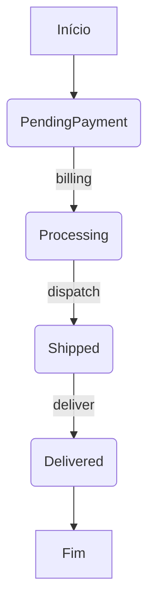

### [ricardotecpro.github.io](https://ricardotecpro.github.io/)

# ☕ Java e Orientação a Objetos: Enumerações e Composição

Este material aborda os conceitos de enumerações e composição em Java, fundamentais para a criação de código mais organizado, legível e robusto.

## 📜 Enumerações (Enums)

Enumerações, ou `enum` em Java, são um tipo especial que permite definir um conjunto de constantes nomeadas e relacionadas de forma literal. Elas trazem maior semântica e legibilidade ao código, além de serem auxiliadas pelo compilador para garantir a segurança de tipos.

### ✅ Checklist
- Definição e discussão
- Exemplo: estados de um pedido
- Conversão de `String` para `enum`
- Representação UML

### 🎯 O que são Enumerações?
- É um tipo especial que serve para especificar de forma literal um conjunto de constantes relacionadas.
- Palavra-chave em Java: `enum`.
- **Vantagem**: Melhor semântica, código mais legível e auxiliado pelo compilador. Isso significa que o compilador pode verificar se você está usando os valores corretos, evitando erros comuns que ocorreriam com o uso de constantes `String` ou `int`.

**Exemplo Prático Simples:**
Imagine que você precisa representar os dias da semana. Em vez de usar inteiros (0 para Domingo, 1 para Segunda, etc.) ou Strings ("DOMINGO", "SEGUNDA"), você pode usar um `enum`:

```java
package br.com.exemplo.enums;

public enum DiaDaSemana {
    DOMINGO,
    SEGUNDA,
    TERCA,
    QUARTA,
    QUINTA,
    SEXTA,
    SABADO;
}
```
Usar `DiaDaSemana.SEGUNDA` é muito mais claro e seguro do que usar o número `1` ou a string `"SEGUNDA"`.

### 🔄 Ciclo de Vida de um Pedido: Exemplo com Enum
Um exemplo clássico é o status de um pedido em um sistema de e-commerce.

**Estados Possíveis:**
1.  `PENDING_PAYMENT` (Pagamento Pendente)
2.  `PROCESSING` (Processando)
3.  `SHIPPED` (Enviado)
4.  `DELIVERED` (Entregue)

**Representação em Diagrama de Atividades UML:**



**Código Java para `OrderStatus` (Status do Pedido):**
```java
package entidades.enums;

public enum StatusPedido {
    PAGAMENTO_PENDENTE,
    PROCESSANDO,
    ENVIADO,
    ENTREGUE;
}
```

**Classe `Pedido` utilizando o `enum StatusPedido`:**
```java
package entidades;

import java.util.Date;
import entidades.enums.StatusPedido;

public class Pedido {

    private Integer id;
    private Date instante;
    private StatusPedido status;

    // Construtores, getters e setters omitidos para brevidade

    public Pedido(Integer id, Date instante, StatusPedido status) {
        this.id = id;
        this.instante = instante;
        this.status = status;
    }

    public Integer getId() {
        return id;
    }

    public void setId(Integer id) {
        this.id = id;
    }

    public Date getInstante() {
        return instante;
    }

    public void setInstante(Date instante) {
        this.instante = instante;
    }

    public StatusPedido getStatus() {
        return status;
    }

    public void setStatus(StatusPedido status) {
        this.status = status;
    }

    @Override
    public String toString() {
        return "Pedido [id=" + id + ", instante=" + instante + ", status=" + status + "]";
    }
}
```

### Conversão de String para Enum
É comum receber o valor de um enum como uma string (por exemplo, de uma entrada do usuário ou de uma API). Java permite converter uma `String` para um `enum` usando o método estático `valueOf()`.

```java
// Atribuição direta
StatusPedido os1 = StatusPedido.ENTREGUE;

// Convertendo de String para enum
// A String deve corresponder exatamente a um dos valores do enum
StatusPedido os2 = StatusPedido.valueOf("ENTREGUE");

System.out.println(os1); // Saída: ENTREGUE
System.out.println(os2); // Saída: ENTREGUE
```
**Atenção:** Se a `String` passada para `valueOf()` não corresponder a nenhuma constante do `enum`, uma exceção `IllegalArgumentException` será lançada.

###  UML Notação para Enums
Em UML, enums são frequentemente representados com o estereótipo `<<enum>>`.

**Exemplo de Notação UML para `StatusPedido`:**

```
<<enum>>
StatusPedido
--------------------
PAGAMENTO_PENDENTE
PROCESSANDO
ENVIADO
ENTREGUE
```
Ou, de forma mais detalhada, mostrando que são constantes:
```
<<enum>>
OrderStatus
--------------------
<<enum constant>> PENDING_PAYMENT
<<enum constant>> PROCESSING
<<enum constant>> SHIPPED
<<enum constant>> DELIVERED
```
Cada constante dentro de um enum é, na verdade, uma instância do próprio enum.

## 🏛️ Design de Classes e Composição

### 🎨 Vamos Falar um Pouco de Design
Em um sistema orientado a objetos, "tudo" é objeto. Para uma melhor organização, flexibilidade, reuso e delegação de responsabilidades, as classes são categorizadas.

### 🏷️ Categorias de Classes
Algumas categorias comuns incluem:
-   **Views (Telas)**: Responsáveis pela interface com o usuário.
-   **Controllers (Controladores)**: Fazem a mediação entre as Views e o restante da aplicação (Models/Services).
-   **Services (Serviços)**: Contêm a lógica de negócio da aplicação.
-   **Repositories (Repositórios)**: Responsáveis pelo acesso e persistência de dados (comunicação com o banco de dados).
-   **Entities (Entidades)**: Representam os objetos de domínio do negócio (ex: `Pedido`, `Cliente`, `Produto`).

A seguir, alguns diagramas UML ilustram como essas categorias podem se relacionar, focando em Entidades e Serviços.

**Diagrama de Entidades:**
Este diagrama mostra as classes de domínio e seus relacionamentos. Por exemplo:
-   Um `Pedido` possui um `Cliente`.
-   Um `Pedido` é composto por vários `ItemPedido`.
-   Cada `ItemPedido` está associado a um `Produto`.
-   `StatusPedido` é um enum usado pela classe `Pedido`.

*Descrição do Diagrama de Entidades (baseado nas imagens do PDF):*
-   **`Order` (Pedido)**
    -   Atributos: `moment` (Data), `status` (OrderStatus)
    -   Métodos: `addItem`, `removeItem`, `total`
    -   Relacionamentos:
        -   Tem um `Client` (Cliente) (1 para 1)
        -   Tem vários `OrderItem` (Itens do Pedido) (1 para muitos, composição)
-   **`Client` (Cliente)**
    -   Atributos: `name` (String), `email` (String), `birthDate` (Data)
-   **`OrderItem` (ItemPedido)**
    -   Atributos: `quantity` (Integer), `price` (Double)
    -   Métodos: `subTotal`
    -   Relacionamentos:
        -   Tem um `Product` (Produto) (1 para 1)
-   **`Product` (Produto)**
    -   Atributos: `name` (String), `price` (Double)
-   **`OrderStatus` (StatusPedido) `<<enum>>`**
    -   Valores: `PENDING_PAYMENT`, `PROCESSING`, `SHIPPED`, `DELIVERED`

**Diagrama de Serviços:**
Este diagrama mostra como os serviços podem interagir com repositórios e outros serviços.
-   `OrderService` (Serviço de Pedido) pode usar um `OrderRepository` (Repositório de Pedido).
-   `AuthService` (Serviço de Autenticação) pode usar um `EmailService` (Serviço de Email).

*Descrição do Diagrama de Serviços (baseado nas imagens do PDF):*
-   **`OrderService` (ServiçoDePedido)**
    -   Métodos: `saveOrder`, `search`
    -   Depende de: `OrderRepository`
-   **`OrderRepository` (RepositórioDePedido)** (Pode ser uma interface implementando `CrudRepository`)
    -   Métodos: `findByDate`
-   **`CrudRepository<T, ID>` (Interface)**
    -   Métodos genéricos: `save`, `delete`, `findById`, `findAll`
-   **`AuthService` (ServiçoDeAutenticação)**
    -   Métodos: `getToken`, `refreshToken`, `sendNewPassword`
    -   Depende de: `EmailService`
-   **`EmailService` (ServiçoDeEmail)**
    -   Métodos: `sendEmail`

### 🧩 Composição
Composição é um tipo de associação fundamental em Orientação a Objetos que permite que um objeto "contenha" outro, estabelecendo uma relação de "tem-um" ou "tem-vários".

-   **Relação "tem-um" ou "tem-vários"**:
    -   "Tem-um": Um objeto `Carro` *tem-um* `Motor`.
    -   "Tem-vários": Um objeto `Pedido` *tem-vários* `ItemPedido`.
-   **Vantagens**:
    -   **Organização**: Divisão clara de responsabilidades.
    -   **Coesão**: Classes com responsabilidades bem definidas são mais coesas.
    -   **Flexibilidade**: Facilita a alteração e evolução do sistema.
    -   **Reuso**: Permite reutilizar classes menores e mais especializadas.

**Nota sobre UML:** Embora o símbolo UML para composição (todo-parte) seja um diamante preto preenchido (agregação é um diamante vazio), no contexto apresentado, "composição" refere-se a qualquer associação do tipo "tem-um" e "tem-vários" onde um objeto é parte de outro ou gerenciado por outro.

**Exemplo prático de Composição:**
Uma `Universidade` é composta por vários `Departamento`s. Se a `Universidade` deixar de existir, os `Departamento`s também deixam.

```java
package br.com.exemplo.composicao;

import java.util.List;
import java.util.ArrayList;

// Classe Parte
class Motor {
    private String tipo;

    public Motor(String tipo) {
        this.tipo = tipo;
    }

    public void ligar() {
        System.out.println("Motor " + tipo + " ligado.");
    }

    public String getTipo() {
        return tipo;
    }
}

// Classe Todo
class Carro {
    private String modelo;
    private Motor motor; // Relação "tem-um" (Composição)

    public Carro(String modelo, String tipoMotor) {
        this.modelo = modelo;
        this.motor = new Motor(tipoMotor); // Motor é criado junto com Carro
    }

    public void ligarCarro() {
        System.out.print(modelo + ": ");
        motor.ligar();
    }

    public String getModelo() {
        return modelo;
    }

    public Motor getMotor() {
        return motor;
    }
}

// Classe Pedido (Todo) e ItemPedido (Parte)
class ItemPedido {
    private String produtoNome;
    private int quantidade;
    private double precoUnitario;

    public ItemPedido(String produtoNome, int quantidade, double precoUnitario) {
        this.produtoNome = produtoNome;
        this.quantidade = quantidade;
        this.precoUnitario = precoUnitario;
    }

    public double calcularSubtotal() {
        return quantidade * precoUnitario;
    }

    @Override
    public String toString() {
        return produtoNome + ", Qtd: " + quantidade + ", Subtotal: R$" + calcularSubtotal();
    }
}

class PedidoComposicao {
    private int numero;
    private List<ItemPedido> itens; // Relação "tem-vários" (Composição)

    public PedidoComposicao(int numero) {
        this.numero = numero;
        this.itens = new ArrayList<>(); // Lista de itens é criada com o Pedido
    }

    public void adicionarItem(String produtoNome, int quantidade, double precoUnitario) {
        this.itens.add(new ItemPedido(produtoNome, quantidade, precoUnitario));
    }

    public void mostrarDetalhes() {
        System.out.println("Pedido Nº: " + numero);
        for (ItemPedido item : itens) {
            System.out.println("- " + item);
        }
    }
}

public class TesteComposicao {
    public static void main(String[] args) {
        // Exemplo "tem-um"
        Carro meuCarro = new Carro("Sedan XPTO", "V6");
        meuCarro.ligarCarro(); // Saída: Sedan XPTO: Motor V6 ligado.

        System.out.println("\n--- Exemplo 'tem-vários' ---");
        // Exemplo "tem-vários"
        PedidoComposicao meuPedido = new PedidoComposicao(101);
        meuPedido.adicionarItem("Caneta", 5, 2.50);
        meuPedido.adicionarItem("Caderno", 2, 15.00);
        meuPedido.mostrarDetalhes();
        /*
        Saída:
        Pedido Nº: 101
        - Caneta, Qtd: 5, Subtotal: R$12.5
        - Caderno, Qtd: 2, Subtotal: R$30.0
        */
    }
}
```
No exemplo `Carro` e `Motor`, o `Motor` é uma parte essencial do `Carro`. Se o `Carro` for destruído, o `Motor` associado a ele geralmente também deixa de ter significado isolado (forte acoplamento).
No exemplo `PedidoComposicao` e `ItemPedido`, os `ItemPedido`s só existem no contexto de um `PedidoComposicao`.

## 🛠️ Exercícios Resolvidos e Propostos

### 🧑‍💼 Exercício Resolvido 1: Trabalhador e Contratos

**Objetivo:** Ler os dados de um trabalhador com N contratos (N fornecido pelo usuário). Depois, solicitar do usuário um mês e mostrar qual foi o salário do funcionário nesse mês.

**Diagrama de Classes UML:**
-   **`Worker` (Trabalhador)**
    -   Atributos: `name` (String), `level` (WorkerLevel), `baseSalary` (Double)
    -   Relacionamento: Tem um `Department` (Departamento)
    -   Relacionamento: Tem vários `HourContract` (ContratosPorHora) (Composição)
    -   Métodos: `addContract`, `removeContract`, `income` (calcularRenda)
-   **`Department` (Departamento)**
    -   Atributos: `name` (String)
-   **`HourContract` (ContratoPorHora)**
    -   Atributos: `date` (Data), `valuePerHour` (Double), `hours` (Integer)
    -   Métodos: `totalValue`
-   **`WorkerLevel` (NivelTrabalhador) `<<enum>>`**
    -   Valores: `JUNIOR`, `MID_LEVEL`, `SENIOR`

**Exemplo de Interação (Console):**
```
Digite o nome do departamento: Design
Digite os dados do trabalhador:
Nome: Alex
Nível: MID_LEVEL
Salário base: 1200.00
Quantos contratos para este trabalhador? 3

Digite os dados do contrato #1:
Data (DD/MM/YYYY): 20/08/2018
Valor por hora: 50.00
Duração (horas): 20

Digite os dados do contrato #2:
Data (DD/MM/YYYY): 13/06/2018
Valor por hora: 30.00
Duração (horas): 18

Digite os dados do contrato #3:
Data (DD/MM/YYYY): 25/08/2018
Valor por hora: 80.00
Duração (horas): 10

Digite o mês e ano para calcular o ganho (MM/YYYY): 08/2018
Nome: Alex
Departamento: Design
Ganhos para 08/2018: 3000.00
```

**Estrutura de Objetos em Memória (Exemplo):**
-   **Objeto `Trabalhador`**:
    -   `nome` = "Alex"
    -   `nivel` = `NivelTrabalhador.MID_LEVEL`
    -   `salarioBase` = 1200.00
    -   `departamento` (Objeto `Departamento`):
        -   `nome` = "Design"
    -   `contratos` (Lista de `ContratoPorHora`):
        -   Objeto `ContratoPorHora` 1: `data`=20/08/2018, `valorPorHora`=50.00, `horas`=20
        -   Objeto `ContratoPorHora` 2: `data`=13/06/2018, `valorPorHora`=30.00, `horas`=18
        -   Objeto `ContratoPorHora` 3: `data`=25/08/2018, `valorPorHora`=80.00, `horas`=10

**Implementação em Java (Esqueleto das classes traduzidas):**

**NivelTrabalhador.java**
```java
package entidades.enums;

public enum NivelTrabalhador {
    JUNIOR,
    MID_LEVEL, // Ou NIVEL_MEDIO
    SENIOR;
}
```

**Departamento.java**
```java
package entidades;

public class Departamento {
    private String nome;

    public Departamento() {
    }

    public Departamento(String nome) {
        this.nome = nome;
    }

    public String getNome() {
        return nome;
    }

    public void setNome(String nome) {
        this.nome = nome;
    }
}
```

**ContratoPorHora.java**
```java
package entidades;

import java.util.Date;

public class ContratoPorHora {
    private Date data;
    private Double valorPorHora;
    private Integer horas;

    public ContratoPorHora() {
    }

    public ContratoPorHora(Date data, Double valorPorHora, Integer horas) {
        this.data = data;
        this.valorPorHora = valorPorHora;
        this.horas = horas;
    }

    public Date getData() {
        return data;
    }

    public void setData(Date data) {
        this.data = data;
    }

    public Double getValorPorHora() {
        return valorPorHora;
    }

    public void setValorPorHora(Double valorPorHora) {
        this.valorPorHora = valorPorHora;
    }

    public Integer getHoras() {
        return horas;
    }

    public void setHoras(Integer horas) {
        this.horas = horas;
    }

    public double valorTotal() {
        return valorPorHora * horas;
    }
}
```

**Trabalhador.java**
```java
package entidades;

import java.util.ArrayList;
import java.util.Calendar;
import java.util.List;
import entidades.enums.NivelTrabalhador;

public class Trabalhador {
    private String nome;
    private NivelTrabalhador nivel;
    private Double salarioBase;

    private Departamento departamento; // Associação "tem-um"
    private List<ContratoPorHora> contratos = new ArrayList<>(); // Associação "tem-vários" (Composição)

    public Trabalhador() {
    }

    public Trabalhador(String nome, NivelTrabalhador nivel, Double salarioBase, Departamento departamento) {
        this.nome = nome;
        this.nivel = nivel;
        this.salarioBase = salarioBase;
        this.departamento = departamento;
    }

    // Getters e Setters
    public String getNome() { return nome; }
    public void setNome(String nome) { this.nome = nome; }
    public NivelTrabalhador getNivel() { return nivel; }
    public void setNivel(NivelTrabalhador nivel) { this.nivel = nivel; }
    public Double getSalarioBase() { return salarioBase; }
    public void setSalarioBase(Double salarioBase) { this.salarioBase = salarioBase; }
    public Departamento getDepartamento() { return departamento; }
    public void setDepartamento(Departamento departamento) { this.departamento = departamento; }
    public List<ContratoPorHora> getContratos() { return contratos; }
    // Não adicionar setContratos para manter a integridade da lista gerenciada internamente

    public void adicionarContrato(ContratoPorHora contrato) {
        contratos.add(contrato);
    }

    public void removerContrato(ContratoPorHora contrato) {
        contratos.remove(contrato);
    }

    public double calcularRenda(int ano, int mes) {
        double soma = salarioBase;
        Calendar cal = Calendar.getInstance();
        for (ContratoPorHora c : contratos) {
            cal.setTime(c.getData());
            int c_ano = cal.get(Calendar.YEAR);
            int c_mes = 1 + cal.get(Calendar.MONTH); // Mês no Calendar é 0-indexed
            if (ano == c_ano && mes == c_mes) {
                soma += c.valorTotal();
            }
        }
        return soma;
    }
}
```
**Para executar no VS Code ou IntelliJ IDEA:**
1.  Crie um projeto Java.
2.  Crie as pastas de pacotes (ex: `src/entidades`, `src/entidades/enums`, `src/aplicacao`).
3.  Coloque cada classe no arquivo `.java` correspondente dentro de sua respectiva pasta de pacote.
4.  Crie uma classe `Programa` (ou `Main`) com o método `main` para interagir com o usuário e testar a lógica.

### ✍️ Exercício Resolvido 2: Posts e Comentários (Demonstração com `StringBuilder`)

**Objetivo:** Instanciar manualmente (hard code) objetos `Post` e `Comment` e mostrá-los na tela do terminal, conforme exemplo. Este exercício é ótimo para praticar a composição e a formatação de strings, onde `StringBuilder` pode ser muito útil para eficiência.

**Diagrama de Classes UML:**
-   **`Post`**
    -   Atributos: `moment` (Data), `title` (String), `content` (String), `likes` (Integer)
    -   Relacionamento: Tem vários `Comment` (Comentários) (Composição)
-   **`Comment` (Comentário)**
    -   Atributos: `text` (String)

**Estrutura dos Objetos e Saída Esperada:**

**Post 1:**
-   `instante`: 21/06/2018 13:05:44
-   `titulo`: "Viajando para a Nova Zelândia"
-   `conteudo`: "Estou indo visitar este país maravilhoso!"
-   `curtidas`: 12
-   Comentários:
    -   "Tenha uma boa viagem"
    -   "Uau, que demais!"

**Post 2:**
-   `instante`: 28/07/2018 23:14:19
-   `titulo`: "Boa noite galera"
-   `conteudo`: "Até amanhã"
-   `curtidas`: 5
-   Comentários:
    -   "Boa noite"
    -   "Que a Força esteja com você"

**Saída no Console:**
```
Viajando para a Nova Zelândia
12 Curtidas - 21/06/2018 13:05:44
Estou indo visitar este país maravilhoso!
Comentários:
Tenha uma boa viagem
Uau, que demais!

Boa noite galera
5 Curtidas - 28/07/2018 23:14:19
Até amanhã
Comentários:
Boa noite
Que a Força esteja com você
```

**Implementação em Java (Esqueleto das classes traduzidas):**

**Comentario.java**
```java
package entidades;

public class Comentario {
    private String texto;

    public Comentario() {
    }

    public Comentario(String texto) {
        this.texto = texto;
    }

    public String getTexto() {
        return texto;
    }

    public void setTexto(String texto) {
        this.texto = texto;
    }
}
```

**Post.java**
```java
package entidades;

import java.text.SimpleDateFormat;
import java.util.ArrayList;
import java.util.Date;
import java.util.List;

public class Post {
    private static SimpleDateFormat sdf = new SimpleDateFormat("dd/MM/yyyy HH:mm:ss");

    private Date instante;
    private String titulo;
    private String conteudo;
    private Integer curtidas;

    private List<Comentario> comentarios = new ArrayList<>(); // Composição

    public Post() {
    }

    public Post(Date instante, String titulo, String conteudo, Integer curtidas) {
        this.instante = instante;
        this.titulo = titulo;
        this.conteudo = conteudo;
        this.curtidas = curtidas;
    }

    // Getters e Setters (com algumas modificações para a lista)
    public Date getInstante() { return instante; }
    public void setInstante(Date instante) { this.instante = instante; }
    public String getTitulo() { return titulo; }
    public void setTitulo(String titulo) { this.titulo = titulo; }
    public String getConteudo() { return conteudo; }
    public void setConteudo(String conteudo) { this.conteudo = conteudo; }
    public Integer getCurtidas() { return curtidas; }
    public void setCurtidas(Integer curtidas) { this.curtidas = curtidas; }
    public List<Comentario> getComentarios() { return comentarios; }
    // Não ter setComentarios(), gerenciar via adicionar/remover

    public void adicionarComentario(Comentario comentario) {
        comentarios.add(comentario);
    }

    public void removerComentario(Comentario comentario) {
        comentarios.remove(comentario);
    }

    @Override
    public String toString() {
        StringBuilder sb = new StringBuilder();
        sb.append(titulo).append("\n");
        sb.append(curtidas);
        sb.append(" Curtidas - ");
        sb.append(sdf.format(instante)).append("\n");
        sb.append(conteudo).append("\n");
        sb.append("Comentários:\n");
        for (Comentario c : comentarios) {
            sb.append(c.getTexto()).append("\n");
        }
        return sb.toString();
    }
}
```
**Uso do `StringBuilder`:**
O método `toString()` da classe `Post` é um excelente candidato para usar `StringBuilder`. Ao concatenar múltiplas Strings dentro de um loop ou em várias etapas, `StringBuilder` é mais eficiente do que usar o operador `+`, pois evita a criação de múltiplos objetos String intermediários.

### 📝 Exercício de Fixação: Sistema de Pedidos

**Objetivo:** Ler os dados de um pedido com N itens (N fornecido pelo usuário). Depois, mostrar um sumário do pedido. O instante do pedido deve ser o instante atual do sistema (`new Date()`).

**Diagrama de Classes UML (Reutilizando e adaptando o anterior):**
-   **`Order` (Pedido)**
    -   Atributos: `moment` (Data), `status` (OrderStatus)
    -   Relacionamentos:
        -   Tem um `Client` (Cliente)
        -   Tem vários `OrderItem` (ItensPedido) (Composição)
    -   Métodos: `addItem`, `removeItem`, `total`
-   **`Client` (Cliente)**
    -   Atributos: `name` (String), `email` (String), `birthDate` (Data)
-   **`OrderItem` (ItemPedido)**
    -   Atributos: `quantity` (Integer), `price` (Double) (preço do produto no momento da compra)
    -   Relacionamento: Tem um `Product` (Produto)
    -   Métodos: `subTotal`
-   **`Product` (Produto)**
    -   Atributos: `name` (String), `price` (Double) (preço atual do produto)
-   **`OrderStatus` (StatusPedido) `<<enum>>`** (Já definido anteriormente)
    -   Valores: `PAGAMENTO_PENDENTE`, `PROCESSANDO`, `ENVIADO`, `ENTREGUE`

**Exemplo de Interação (Console):**
```
Digite os dados do cliente:
Nome: Alex Green
Email: alex@gmail.com
Data de Nascimento (DD/MM/YYYY): 15/03/1985

Digite os dados do pedido:
Status: PROCESSANDO
Quantos itens para este pedido? 2

Digite os dados do item #1:
Nome do produto: TV
Preço do produto: 1000.00
Quantidade: 1

Digite os dados do item #2:
Nome do produto: Mouse
Preço do produto: 40.00
Quantidade: 2

RESUMO DO PEDIDO:
Momento do pedido: 20/04/2018 11:25:09 (Será a data/hora atual)
Status do pedido: PROCESSANDO
Cliente: Alex Green (15/03/1985) - alex@gmail.com
Itens do pedido:
TV, R$1000.00, Quantidade: 1, Subtotal: R$1000.00
Mouse, R$40.00, Quantidade: 2, Subtotal: R$80.00
Preço total: R$1080.00
```

**Objetos em Memória (Exemplo da estrutura):**
-   **Objeto `Pedido`**:
    -   `instante`: (data/hora atual)
    -   `status`: `StatusPedido.PROCESSANDO`
    -   `cliente` (Objeto `Cliente`):
        -   `nome`: "Alex Green"
        -   `email`: "alex@gmail.com"
        -   `dataNascimento`: 15/03/1985
    -   `itens` (Lista de `ItemPedido`):
        -   **Objeto `ItemPedido` 1**:
            -   `quantidade`: 1
            -   `preco`: 1000.00 (preço da TV no momento da compra)
            -   `produto` (Objeto `Produto`):
                -   `nome`: "TV"
                -   `preco`: 1000.00 (preço atual da TV, poderia ser diferente do preço no item)
        -   **Objeto `ItemPedido` 2**:
            -   `quantidade`: 2
            -   `preco`: 40.00 (preço do Mouse no momento da compra)
            -   `produto` (Objeto `Produto`):
                -   `nome`: "Mouse"
                -   `preco`: 40.00 (preço atual do Mouse)

**Implementação em Java (Esqueleto das classes traduzidas):**

**Cliente.java**
```java
package entidades;

import java.text.SimpleDateFormat;
import java.util.Date;

public class Cliente {
    private static SimpleDateFormat sdf = new SimpleDateFormat("dd/MM/yyyy");

    private String nome;
    private String email;
    private Date dataNascimento;

    public Cliente() {
    }

    public Cliente(String nome, String email, Date dataNascimento) {
        this.nome = nome;
        this.email = email;
        this.dataNascimento = dataNascimento;
    }

    // Getters e Setters
    public String getNome() { return nome; }
    public void setNome(String nome) { this.nome = nome; }
    public String getEmail() { return email; }
    public void setEmail(String email) { this.email = email; }
    public Date getDataNascimento() { return dataNascimento; }
    public void setDataNascimento(Date dataNascimento) { this.dataNascimento = dataNascimento; }

    @Override
    public String toString() {
        return nome + " (" + sdf.format(dataNascimento) + ") - " + email;
    }
}
```

**Produto.java**
```java
package entidades;

public class Produto {
    private String nome;
    private Double preco;

    public Produto() {
    }

    public Produto(String nome, Double preco) {
        this.nome = nome;
        this.preco = preco;
    }

    // Getters e Setters
    public String getNome() { return nome; }
    public void setNome(String nome) { this.nome = nome; }
    public Double getPreco() { return preco; }
    public void setPreco(Double preco) { this.preco = preco; }
}
```

**ItemPedido.java**
```java
package entidades;

public class ItemPedido {
    private Integer quantidade;
    private Double preco; // Preço do produto no momento da inclusão no pedido

    private Produto produto; // Composição - ItemPedido tem um Produto

    public ItemPedido() {
    }

    public ItemPedido(Integer quantidade, Double preco, Produto produto) {
        this.quantidade = quantidade;
        this.preco = preco;
        this.produto = produto;
    }

    // Getters e Setters
    public Integer getQuantidade() { return quantidade; }
    public void setQuantidade(Integer quantidade) { this.quantidade = quantidade; }
    public Double getPreco() { return preco; }
    public void setPreco(Double preco) { this.preco = preco; }
    public Produto getProduto() { return produto; }
    public void setProduto(Produto produto) { this.produto = produto; }

    public double subTotal() {
        return quantidade * preco;
    }

    @Override
    public String toString() {
        return getProduto().getNome()
                + ", R$"
                + String.format("%.2f", preco)
                + ", Quantidade: "
                + quantidade
                + ", Subtotal: R$"
                + String.format("%.2f", subTotal());
    }
}
```

**Pedido.java**
```java
package entidades;

import java.text.SimpleDateFormat;
import java.util.ArrayList;
import java.util.Date;
import java.util.List;
import entidades.enums.StatusPedido;

public class Pedido {
    private static SimpleDateFormat sdf = new SimpleDateFormat("dd/MM/yyyy HH:mm:ss");

    private Date instante;
    private StatusPedido status;

    private Cliente cliente; // Composição
    private List<ItemPedido> itens = new ArrayList<>(); // Composição

    public Pedido() {
    }

    public Pedido(Date instante, StatusPedido status, Cliente cliente) {
        this.instante = instante;
        this.status = status;
        this.cliente = cliente;
    }

    // Getters e Setters (com cuidado para a lista)
    public Date getInstante() { return instante; }
    public void setInstante(Date instante) { this.instante = instante; }
    public StatusPedido getStatus() { return status; }
    public void setStatus(StatusPedido status) { this.status = status; }
    public Cliente getCliente() { return cliente; }
    public void setCliente(Cliente cliente) { this.cliente = cliente; }
    public List<ItemPedido> getItens() { return itens; }
    // Não adicionar setItens

    public void adicionarItem(ItemPedido item) {
        itens.add(item);
    }

    public void removerItem(ItemPedido item) {
        itens.remove(item);
    }

    public double total() {
        double soma = 0.0;
        for (ItemPedido item : itens) {
            soma += item.subTotal();
        }
        return soma;
    }

    @Override
    public String toString() {
        StringBuilder sb = new StringBuilder();
        sb.append("Momento do pedido: ");
        sb.append(sdf.format(instante)).append("\n");
        sb.append("Status do pedido: ");
        sb.append(status).append("\n");
        sb.append("Cliente: ");
        sb.append(cliente).append("\n"); // Utiliza o toString() de Cliente
        sb.append("Itens do pedido:\n");
        for (ItemPedido item : itens) {
            sb.append(item).append("\n"); // Utiliza o toString() de ItemPedido
        }
        sb.append("Preço total: R$");
        sb.append(String.format("%.2f", total()));
        return sb.toString();
    }
}
```

**Configuração em VS Code ou IntelliJ IDEA:**
1.  Crie um novo projeto Java.
2.  Organize as classes em pacotes (ex: `entidades`, `entidades.enums`, `aplicacao`).
    -   `entidades/Cliente.java`
    -   `entidades/Produto.java`
    -   `entidades/ItemPedido.java`
    -   `entidades/Pedido.java`
    -   `entidades/enums/StatusPedido.java` (reutilize a definição anterior)
3.  Na pasta `aplicacao`, crie a classe principal (ex: `ProgramaPedido.java`) com o método `main`.
4.  No método `main`, implemente a lógica para:
    -   Ler os dados do cliente.
    -   Ler os dados do pedido (status).
    -   Perguntar quantos itens serão adicionados.
    -   Em um loop, ler os dados de cada item (nome do produto, preço do produto, quantidade).
    -   Criar os objetos `Produto`, `ItemPedido`, `Cliente` e `Pedido`.
    -   Associar os objetos (adicionar itens ao pedido, associar cliente ao pedido).
    -   Instanciar o pedido com `new Date()` para o momento.
    -   Imprimir o resumo do pedido usando o método `toString()` da classe `Pedido`.

Este exercício reforça os conceitos de enumeração, composição, entrada de dados, formatação de saída e a estruturação de um pequeno sistema orientado a objetos.

---
## 📚