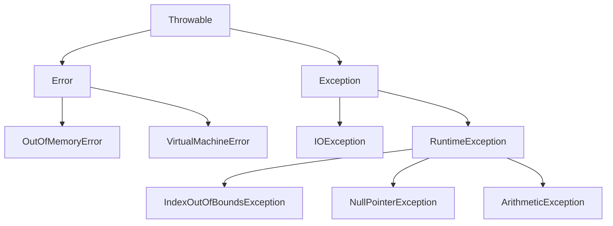

# Tratamento de Exceções em Java ☕

Este capítulo aborda o tratamento de exceções em Java, um mecanismo fundamental para lidar com erros e situações inesperadas durante a execução de um programa.

## Discussão Inicial sobre Exceções 🧐

Atenção: Alguns conceitos podem parecer complexos inicialmente, mas se tornarão mais claros com os exemplos práticos apresentados.

### O que são Exceções?
Uma exceção é qualquer condição de erro ou comportamento inesperado encontrado por um programa em execução. Em Java, uma exceção é um objeto herdado da classe:

* `java.lang.Exception`: O compilador obriga o desenvolvedor a tratar ou propagar essas exceções. São geralmente usadas para condições das quais um programa pode razoavelmente tentar se recuperar (ex: arquivo não encontrado, problema de rede).
* `java.lang.RuntimeException`: O compilador *não* obriga o tratamento ou propagação. Indicam frequentemente bugs de programação (ex: acessar um índice inválido de um array, usar um objeto nulo) ou problemas irrecuperáveis no ambiente de execução.

Quando uma exceção é "lançada" (thrown), ela é propagada na pilha de chamadas de métodos em execução. Se nenhum método na pilha de chamadas capturar (tratar) a exceção, o programa é encerrado e a pilha de chamadas da exceção é impressa no console.

### Hierarquia de Exceções do Java 🌳
A classe base para todas as exceções e erros em Java é `java.lang.Throwable`. Abaixo dela, a hierarquia se divide principalmente em:

* **`Error`**: Representa problemas sérios que uma aplicação razoável não deveria tentar tratar (ex: `OutOfMemoryError`, `VirtualMachineError`). Esses geralmente indicam problemas irrecuperáveis na JVM ou no ambiente.
* **`Exception`**: Representa condições que uma aplicação pode querer tratar.
    * **`IOException`**: Exceções relacionadas a operações de entrada/saída (ex: falha ao ler um arquivo). É uma *checked exception*.
    * **`RuntimeException`**: Exceções que podem ocorrer durante a operação normal da JVM (ex: `NullPointerException`, `IndexOutOfBoundsException`, `ArithmeticException`). São *unchecked exceptions*.



### Por que usar Exceções? 🤔
O modelo de tratamento de exceções permite que erros sejam tratados de forma consistente, flexível e seguindo boas práticas de programação.

**Vantagens**:

* **Separação de Lógica**: Delega a lógica de tratamento de erro para blocos específicos (blocos `catch`), separando-a do código principal do programa. Isso torna o código mais limpo e legível.
* **Tratamento Organizado**: Permite tratar diferentes tipos de exceções de forma organizada, inclusive hierarquicamente (capturar uma exceção mais genérica pode tratar várias exceções filhas).
* **Propagação de Erros**: Se um método não sabe como tratar uma exceção, ele pode propagá-la para o método chamador, permitindo que o erro seja tratado no nível mais apropriado.
* **Informações Detalhadas**: Objetos de exceção podem carregar informações detalhadas sobre o erro (mensagem, pilha de chamadas), o que auxilia na depuração.
* **Criação de Exceções Personalizadas**: Permite definir tipos de exceção específicos para a aplicação, tornando o tratamento de erros mais semântico.

## Estrutura `try-catch` 🛡️
A estrutura `try-catch` é o principal mecanismo para tratar exceções em Java.

* **Bloco `try`**: Contém o código que representa a execução normal do trecho de código que *pode* acarretar em uma exceção.
* **Bloco `catch`**: Contém o código a ser executado caso uma exceção específica ocorra dentro do bloco `try`.
    * Deve ser especificado o tipo da exceção a ser tratada. Upcasting é permitido (ou seja, você pode capturar `Exception` para pegar qualquer exceção filha).
    * Pode haver múltiplos blocos `catch` para tratar diferentes tipos de exceções. A ordem dos blocos `catch` importa: coloque os mais específicos antes dos mais genéricos.

### Sintaxe
```java
try {
    // Código que pode lançar uma exceção
} catch (TipoDeExcecao1 nomeVariavelExcecao1) {
    // Código para tratar TipoDeExcecao1
} catch (TipoDeExcecao2 nomeVariavelExcecao2) {
    // Código para tratar TipoDeExcecao2
} catch (Exception nomeVariavelExcecaoGeral) {
    // Código para tratar qualquer outra exceção (se não capturada antes)
}
```

### Exemplo Prático: Divisão por Zero e Entrada Inválida
Vamos criar um programa simples que pede dois números ao usuário e tenta dividir o primeiro pelo segundo.

```java
package aplicacao;

import java.util.InputMismatchException;
import java.util.Scanner;

public class ProgramaDivisao {

    public static void main(String[] args) {
        Scanner sc = new Scanner(System.in);

        try {
            System.out.print("Digite o numerador: ");
            int numerador = sc.nextInt();

            System.out.print("Digite o denominador: ");
            int denominador = sc.nextInt();

            int resultado = numerador / denominador;
            System.out.println("Resultado: " + resultado);

        } catch (ArithmeticException e) {
            System.err.println("Erro: Não é possível dividir por zero.");
        } catch (InputMismatchException e) {
            System.err.println("Erro: Entrada inválida. Por favor, digite números inteiros.");
        } catch (Exception e) { // Captura genérica para outras exceções inesperadas
            System.err.println("Ocorreu um erro inesperado: " + e.getMessage());
        } finally {
            System.out.println("Bloco try-catch finalizado.");
            sc.close(); // Boa prática: fechar o Scanner no finally
        }

        System.out.println("Fim do programa.");
    }
}
```

**Como executar este exemplo:**

* **VS Code**:
    1.  Certifique-se de ter o Java Development Kit (JDK) e a extensão "Extension Pack for Java" da Microsoft instalados.
    2.  Crie um arquivo chamado `ProgramaDivisao.java` dentro de uma pasta `aplicacao`.
    3.  Cole o código acima.
    4.  Clique com o botão direito no editor e selecione "Run Java".
* **IntelliJ IDEA**:
    1.  Certifique-se de ter o JDK configurado no IntelliJ.
    2.  Crie um novo projeto Java.
    3.  Crie um pacote chamado `aplicacao` (clique direito na pasta `src` -> New -> Package).
    4.  Dentro do pacote `aplicacao`, crie uma classe Java chamada `ProgramaDivisao`.
    5.  Cole o código acima.
    6.  Clique na seta verde ao lado da declaração `public class ProgramaDivisao` ou do método `main` e selecione "Run 'ProgramaDivisao.main()'".

**Testando o exemplo:**
1.  Execute o programa e forneça `10` e `2`. Resultado: `5`.
2.  Execute novamente e forneça `10` e `0`. Resultado: `Erro: Não é possível dividir por zero.`
3.  Execute novamente e forneça `dez` para o numerador. Resultado: `Erro: Entrada inválida. Por favor, digite números inteiros.`

### Exemplo do Documento Original (Acesso a Array)

```java
package aplicacao;

import java.util.InputMismatchException;
import java.util.Scanner;

public class Programa {

    public static void main(String[] args) {
        Scanner sc = new Scanner(System.in);

        try {
            System.out.println("Digite alguns nomes separados por espaço:");
            String[] vetor = sc.nextLine().split(" "); // Lê a linha e divide por espaços

            System.out.println("Digite a posição do vetor que deseja acessar (começando em 0):");
            int posicao = sc.nextInt(); // Lê um inteiro para a posição

            System.out.println("Nome na posição " + posicao + ": " + vetor[posicao]);

        } catch (ArrayIndexOutOfBoundsException e) {
            // Esta exceção ocorre se 'posicao' for menor que 0 ou maior/igual ao tamanho de 'vetor'
            System.err.println("Posição inválida no vetor!");
        } catch (InputMismatchException e) {
            // Esta exceção ocorre se o usuário não digitar um número inteiro para 'posicao'
            System.err.println("Erro de entrada: A posição deve ser um número inteiro.");
        } catch (Exception e) {
             System.err.println("Ocorreu um erro inesperado: " + e.getMessage());
        }

        System.out.println("Fim do programa.");
        sc.close();
    }
}
```
**Teste este exemplo:**
1.  Entrada: `Ana Bob Carlos`, Posição: `1`. Saída: `Nome na posição 1: Bob`.
2.  Entrada: `Ana Bob`, Posição: `2`. Saída: `Posição inválida no vetor!`.
3.  Entrada: `Ana Bob`, Posição: `abc`. Saída: `Erro de entrada: A posição deve ser um número inteiro.`.

## Pilha de Chamadas de Métodos (Call Stack) 🥞
Quando um programa Java executa, a JVM mantém uma "pilha de chamadas" (call stack). Cada vez que um método é chamado, um novo "quadro" (stack frame) é adicionado ao topo da pilha. Este quadro contém informações sobre o método, como seus parâmetros e variáveis locais. Quando o método termina, seu quadro é removido da pilha.

Se uma exceção ocorre em um método e não é tratada por ele, a JVM "desempilha" a pilha de chamadas. Isso significa que o método atual é interrompido, e a exceção é propagada para o método que o chamou (o método anterior na pilha). Esse processo continua até que:
1.  Um método na pilha de chamadas capture e trate a exceção usando um bloco `try-catch`.
2.  A exceção chegue ao topo da pilha (ao método `main`) sem ser tratada. Neste caso, o programa termina e a "pilha de rastreamento" (stack trace) da exceção é impressa, mostrando a sequência de chamadas de método que levaram ao erro.

### Exemplo de Pilha de Chamadas e Propagação
```java
package aplicacao;

import java.util.InputMismatchException;
import java.util.Scanner;

public class ProgramaPilhaChamadas {

    public static void main(String[] args) {
        System.out.println("--- INÍCIO DO MÉTODO main ---");
        metodo1();
        System.out.println("--- FIM DO MÉTODO main ---");
    }

    public static void metodo1() {
        System.out.println("*** INÍCIO DO metodo1 ***");
        metodo2();
        System.out.println("*** FIM DO metodo1 ***");
    }

    public static void metodo2() {
        System.out.println("+++ INÍCIO DO metodo2 +++");
        Scanner sc = new Scanner(System.in);

        try {
            System.out.println("Digite alguns nomes separados por espaço:");
            String[] vetor = sc.nextLine().split(" ");
            System.out.println("Digite a posição do vetor que deseja acessar:");
            int posicao = sc.nextInt();
            System.out.println(vetor[posicao]);
        } catch (ArrayIndexOutOfBoundsException e) {
            System.err.println("Posição inválida!");
            // e.printStackTrace(); // Descomente para ver a pilha de chamadas completa da exceção
        } catch (InputMismatchException e) {
            System.err.println("Erro de entrada de dados!");
            // e.printStackTrace();
        }
        // sc.close(); // Fechar o Scanner aqui pode dar problema se uma exceção ocorrer antes
                   // É melhor fechar no main se o Scanner for passado, ou usar try-with-resources.
                   // Neste exemplo simples, para evitar complexidade, deixaremos aberto ou
                   // podemos fechar aqui se garantirmos que não haverá mais leitura.
                   // A melhor prática é usar try-with-resources para System.in globalmente
                   // ou fechar explicitamente no método que o criou.

        System.out.println("+++ FIM DO metodo2 +++");
        // Se o Scanner for usado apenas em metodo2, feche-o aqui.
        // No entanto, como é System.in, geralmente não se fecha até o final do programa.
        // Para este exemplo específico, vamos omitir o sc.close() em metodo2
        // e assumir que o Scanner principal (se houvesse um no main) controlaria o System.in.
    }
}
```
**Explicação:**
* `main` chama `metodo1`.
* `metodo1` chama `metodo2`.
* Em `metodo2`, se ocorrer uma `ArrayIndexOutOfBoundsException` (por exemplo, se você digitar uma posição que não existe no vetor), o bloco `catch` em `metodo2` a tratará.
* Se `metodo2` não tivesse um bloco `try-catch` para `ArrayIndexOutOfBoundsException`, a exceção seria propagada para `metodo1`.
* Se `metodo1` também não a tratasse, ela seria propagada para `main`.
* Se `main` não a tratasse, o programa terminaria e imprimiria a pilha de rastreamento.

A chamada `e.printStackTrace();` dentro de um bloco `catch` é muito útil para depuração, pois mostra exatamente onde a exceção ocorreu e a sequência de chamadas que levou a ela.

## Bloco `finally` 🧹
O bloco `finally` é usado em conjunto com `try-catch`. O código dentro de um bloco `finally` é **garantido** de ser executado, independentemente de uma exceção ter sido lançada ou não, ou mesmo se uma exceção lançada foi capturada ou não.

**Uso Clássico**: Liberar recursos externos, como fechar arquivos, conexões de banco de dados, ou sockets de rede. Isso garante que os recursos sejam liberados mesmo que ocorram erros.

### Sintaxe:
```java
try {
    // Código que pode lançar uma exceção
} catch (TipoDeExcecao1 e1) {
    // Trata TipoDeExcecao1
} finally {
    // Este código SEMPRE será executado
}
```
Um bloco `try` pode ter um `finally` sem nenhum `catch`, ou com múltiplos `catch` e um `finally`.

### Exemplo Prático com `finally` (Leitura de Arquivo)

```java
package aplicacao;

import java.io.File;
import java.io.FileNotFoundException; // Import específico para arquivo não encontrado
import java.util.Scanner;

public class ProgramaFinally {

    public static void main(String[] args) {
        File arquivo = new File("C:\\temp\\entrada.txt"); // Tente criar este arquivo para teste
        Scanner sc = null;

        try {
            sc = new Scanner(arquivo); // Tenta abrir o arquivo
            System.out.println("Arquivo aberto com sucesso.");
            while (sc.hasNextLine()) {
                System.out.println(sc.nextLine());
            }
        } catch (FileNotFoundException e) { // Exceção específica para arquivo não encontrado
            System.err.println("Erro ao abrir o arquivo: " + e.getMessage());
            // e.printStackTrace(); // Útil para depuração
        } finally {
            // Este bloco é executado mesmo que o arquivo não seja encontrado
            // ou se outra exceção ocorrer durante a leitura.
            if (sc != null) {
                System.out.println("Fechando o Scanner no bloco finally.");
                sc.close(); // Garante que o Scanner seja fechado se foi aberto
            } else {
                System.out.println("Scanner não foi inicializado, nada a fechar no finally.");
            }
        }
        System.out.println("Fim do programa.");
    }
}
```
**Para testar:**
1.  Crie um arquivo `entrada.txt` em `C:\temp\` (ou ajuste o caminho) com algum texto. Execute.
2.  Delete o arquivo `entrada.txt` ou renomeie-o. Execute novamente. Você verá a mensagem de erro e o bloco `finally` ainda sendo executado.

### `try-with-resources` (Alternativa Moderna ao `finally` para Recursos)
A partir do Java 7, a instrução `try-with-resources` simplifica o gerenciamento de recursos que implementam a interface `java.lang.AutoCloseable` (como `Scanner`, `FileInputStream`, conexões JDBC). Os recursos declarados no `try` são automaticamente fechados ao final do bloco, seja ele concluído normalmente ou por uma exceção.

**Exemplo com `try-with-resources`:**
```java
package aplicacao;

import java.io.File;
import java.io.FileNotFoundException;
import java.util.Scanner;

public class ProgramaTryWithResources {

    public static void main(String[] args) {
        File arquivo = new File("C:\\temp\\entrada.txt");

        // O Scanner 'sc' será fechado automaticamente
        try (Scanner sc = new Scanner(arquivo)) {
            System.out.println("Arquivo aberto com sucesso (try-with-resources).");
            while (sc.hasNextLine()) {
                System.out.println(sc.nextLine());
            }
        } catch (FileNotFoundException e) {
            System.err.println("Erro ao abrir o arquivo (try-with-resources): " + e.getMessage());
        }
        // Não é necessário um bloco finally para fechar 'sc'
        System.out.println("Fim do programa (try-with-resources).");
    }
}
```
Esta forma é geralmente preferida por ser mais concisa e menos propensa a erros (como esquecer de fechar um recurso).

## Criando Exceções Personalizadas 🛠️
Às vezes, as exceções padrão do Java não descrevem adequadamente um erro específico da lógica de negócios da sua aplicação. Nesses casos, você pode criar suas próprias classes de exceção.

**Como fazer:**
1.  Crie uma nova classe que herde de `Exception` (para criar uma *checked exception*) ou `RuntimeException` (para uma *unchecked exception*).
2.  É uma boa prática fornecer um construtor que aceite uma mensagem de erro (String) e a passe para o construtor da superclasse (`super(mensagem)`).
3.  Você também pode adicionar outros construtores ou campos à sua exceção personalizada, se necessário, para carregar mais informações sobre o erro.

### Sugestão de Estrutura de Pacotes "model"
Para organizar o projeto, pode-se usar a seguinte estrutura de pacotes dentro do seu diretório `src`:
```
model/
├── entidades/     // Classes de entidade (ex: Reserva, Conta)
├── enums/         // Enumerações
├── excecoes/      // Suas exceções personalizadas (ex: ExcecaoDominio)
└── servicos/      // Classes de serviço
```

### Problema Exemplo: Reserva de Hotel 🏨
Vamos criar um programa para gerenciar reservas de hotel.

**Requisitos:**
* Ler dados da reserva: número do quarto, data de entrada, data de saída.
* Mostrar dados da reserva e sua duração em dias.
* Ler novas datas para atualizar a reserva.
* Mostrar dados atualizados.

**Regras de Validação (que podem lançar exceções):**
1.  Alterações de reserva só podem ocorrer para datas futuras.
2.  A data de saída deve ser maior (posterior) que a data de entrada.

**Estrutura da Classe `Reserva` (simplificada):**
```java
// Em model/entidades/Reserva.java
package model.entidades;

import java.text.SimpleDateFormat;
import java.util.Date;
import java.util.concurrent.TimeUnit;
import model.excecoes.ExcecaoDominio; // Nossa exceção personalizada

public class Reserva {
    private Integer numeroQuarto;
    private Date dataEntrada;
    private Date dataSaida;

    private static SimpleDateFormat sdf = new SimpleDateFormat("dd/MM/yyyy");

    public Reserva(Integer numeroQuarto, Date dataEntrada, Date dataSaida) throws ExcecaoDominio {
        if (!dataSaida.after(dataEntrada)) {
            throw new ExcecaoDominio("Erro na reserva: A data de saída deve ser posterior à data de entrada.");
        }
        // Validação adicional: não permitir check-in no passado na criação (opcional aqui)
        Date agora = new Date();
        if (dataEntrada.before(agora) || dataSaida.before(agora)) {
             throw new ExcecaoDominio("Erro na reserva: As datas da reserva devem ser futuras.");
        }
        this.numeroQuarto = numeroQuarto;
        this.dataEntrada = dataEntrada;
        this.dataSaida = dataSaida;
    }

    // Getters e Setters (com validação nos setters se necessário)
    public Integer getNumeroQuarto() { return numeroQuarto; }
    public void setNumeroQuarto(Integer numeroQuarto) { this.numeroQuarto = numeroQuarto; }
    public Date getDataEntrada() { return dataEntrada; }
    public Date getDataSaida() { return dataSaida; }

    public long duracao() {
        long diff = dataSaida.getTime() - dataEntrada.getTime(); // Diferença em milissegundos
        return TimeUnit.DAYS.convert(diff, TimeUnit.MILLISECONDS); // Converte para dias
    }

    public void atualizarDatas(Date novaDataEntrada, Date novaDataSaida) throws ExcecaoDominio {
        Date agora = new Date();
        if (novaDataEntrada.before(agora) || novaDataSaida.before(agora)) {
            // Lança nossa exceção personalizada
            throw new ExcecaoDominio("Erro na atualização: As datas da reserva para atualização devem ser futuras.");
        }
        if (!novaDataSaida.after(novaDataEntrada)) {
            throw new ExcecaoDominio("Erro na atualização: A data de saída deve ser posterior à data de entrada.");
        }
        this.dataEntrada = novaDataEntrada;
        this.dataSaida = novaDataSaida;
    }

    @Override
    public String toString() {
        return "Reserva: Quarto " + numeroQuarto +
               ", Entrada: " + sdf.format(dataEntrada) +
               ", Saída: " + sdf.format(dataSaida) +
               ", " + duracao() + " noites";
    }
}
```

**Exceção Personalizada `ExcecaoDominio`:**
```java
// Em model/excecoes/ExcecaoDominio.java
package model.excecoes;

// Pode ser RuntimeException (unchecked) ou Exception (checked)
// Se for Exception, o compilador obrigará o tratamento com try-catch ou throws.
// Se for RuntimeException, o tratamento é opcional (mas recomendado para erros esperados).
// Para regras de negócio, usar Exception (checked) é muitas vezes uma boa prática,
// pois força o chamador a pensar sobre como lidar com a falha.
// Vamos usar Exception aqui para demonstrar a obrigatoriedade do tratamento.
public class ExcecaoDominio extends Exception { // Se fosse RuntimeException, não precisaria do 'throws' no construtor e métodos

    public ExcecaoDominio(String msg) {
        super(msg); // Repassa a mensagem para o construtor da superclasse (Exception)
    }
}
```

**Programa Principal:**
```java
// Em aplicacao/ProgramaReserva.java
package aplicacao;

import model.entidades.Reserva;
import model.excecoes.ExcecaoDominio;

import java.text.ParseException;
import java.text.SimpleDateFormat;
import java.util.Date;
import java.util.Scanner;

public class ProgramaReserva {
    public static void main(String[] args) {
        Scanner sc = new Scanner(System.in);
        SimpleDateFormat sdf = new SimpleDateFormat("dd/MM/yyyy");

        try {
            System.out.print("Número do quarto: ");
            int numero = sc.nextInt();
            System.out.print("Data de entrada (dd/MM/yyyy): ");
            Date dataEntrada = sdf.parse(sc.next());
            System.out.print("Data de saída (dd/MM/yyyy): ");
            Date dataSaida = sdf.parse(sc.next());

            Reserva reserva = new Reserva(numero, dataEntrada, dataSaida);
            System.out.println(reserva);

            System.out.println("\nEntre com os dados para atualizar a reserva:");
            System.out.print("Nova data de entrada (dd/MM/yyyy): ");
            dataEntrada = sdf.parse(sc.next());
            System.out.print("Nova data de saída (dd/MM/yyyy): ");
            dataSaida = sdf.parse(sc.next());

            reserva.atualizarDatas(dataEntrada, dataSaida);
            System.out.println("Reserva atualizada: " + reserva);

        } catch (ParseException e) {
            System.err.println("Erro: Formato de data inválido.");
        } catch (ExcecaoDominio e) { // Capturando nossa exceção personalizada
            System.err.println(e.getMessage());
        } catch (RuntimeException e) { // Para capturar outros erros de tempo de execução (ex: InputMismatchException)
            System.err.println("Erro inesperado de tempo de execução: " + e.getMessage());
            // e.printStackTrace(); // Para depuração
        }

        sc.close();
    }
}
```

**Exemplos de Interação (como no documento original):**

1.  **Reserva e atualização válidas:**
    ```
    Número do quarto: 8021
    Data de entrada (dd/MM/yyyy): 23/09/2025
    Data de saída (dd/MM/yyyy): 26/09/2025
    Reserva: Quarto 8021, Entrada: 23/09/2025, Saída: 26/09/2025, 3 noites

    Entre com os dados para atualizar a reserva:
    Nova data de entrada (dd/MM/yyyy): 24/09/2025
    Nova data de saída (dd/MM/yyyy): 29/09/2025
    Reserva atualizada: Reserva: Quarto 8021, Entrada: 24/09/2025, Saída: 29/09/2025, 5 noites
    ```

2.  **Erro: Data de saída anterior à data de entrada (na criação):**
    ```
    Número do quarto: 8021
    Data de entrada (dd/MM/yyyy): 23/09/2025
    Data de saída (dd/MM/yyyy): 21/09/2025
    Erro na reserva: A data de saída deve ser posterior à data de entrada.
    ```

3.  **Erro: Datas de atualização no passado:**
    ```
    Número do quarto: 8021
    Data de entrada (dd/MM/yyyy): 23/09/2025
    Data de saída (dd/MM/yyyy): 26/09/2025
    Reserva: Quarto 8021, Entrada: 23/09/2025, Saída: 26/09/2025, 3 noites

    Entre com os dados para atualizar a reserva:
    Nova data de entrada (dd/MM/yyyy): 24/09/2015
    Nova data de saída (dd/MM/yyyy): 29/09/2015
    Erro na atualização: As datas da reserva para atualização devem ser futuras.
    ```

## Abordagens de Solução e Resumo 📝

No desenvolvimento, poderíamos ter diferentes abordagens para validação:

* **Solução 1 (muito ruim):** Lógica de validação toda no programa principal (ex: `ProgramaReserva.java`).
    * Desvantagem: A lógica de validação não é delegada à classe `Reserva`, que é quem deveria conhecer suas próprias regras. O código fica acoplado e difícil de manter.

* **Solução 2 (ruim):** Métodos na classe `Reserva` retornando códigos de erro (ex: um `String` ou um `int`).
    * Desvantagens:
        * A semântica da operação é prejudicada (um método `atualizarDatas` deveria atualizar datas, não primariamente retornar um status de erro).
        * E se o método já precisasse retornar um valor específico (ex: uma `String` com um resumo)?
        * Não é possível usar essa abordagem para tratar erros em construtores de forma elegante.
        * O compilador não ajuda: o programador deve "lembrar" de verificar o código de retorno.
        * A lógica fica estruturada em condicionais aninhadas (`if-else if-else`).

* **Solução 3 (boa):** Tratamento de exceções (como implementado acima).
    * **Vantagens:**
        * **Lógica Delegada**: A classe `Reserva` é responsável por suas próprias validações e lança exceções quando regras são violadas.
        * **Construtores**: Construtores podem lançar exceções, indicando que a criação do objeto falhou.
        * **Auxílio do Compilador** (para *checked exceptions*): O compilador obriga o tratamento, prevenindo que erros sejam ignorados.
        * **Código Mais Limpo**: Evita condicionais aninhadas para tratamento de erro. A execução é interrompida no ponto do erro e transferida para o bloco `catch` correspondente.
        * **Captura Abrangente**: É possível capturar tanto exceções personalizadas quanto exceções do sistema (`ParseException`, `InputMismatchException`).

### Palavras-chave Importantes no Tratamento de Exceções:
* **`try`**: Define um bloco de código que será monitorado para exceções.
* **`catch`**: Define um bloco de código para tratar uma exceção específica que ocorreu no bloco `try`.
* **`finally`**: Define um bloco de código que sempre será executado após o `try` (e `catch`, se houver), independentemente de uma exceção ter ocorrido ou não.
* **`throw`**: Usado para *lançar* explicitamente uma instância de uma exceção. Interrompe o fluxo normal do método e "corta" sua execução.
    ```java
    if (saldo < valorSaque) {
        throw new IllegalArgumentException("Saldo insuficiente.");
    }
    ```
* **`throws`**: Usado na assinatura de um método para indicar que ele *pode* lançar certas *checked exceptions*, e que não as trata internamente. O método que chama um método com `throws` deve tratar a exceção ou propagá-la também usando `throws`.
    ```java
    // O método informa que pode lançar IOException e quem o chamar deve tratar.
    public void lerArquivo(String nomeArquivo) throws IOException {
        // código que pode lançar IOException...
    }
    ```

### `Exception` vs. `RuntimeException`
* **`Exception` (e suas subclasses, exceto `RuntimeException` e suas subclasses):** São *checked exceptions*. O compilador obriga que sejam tratadas (com `try-catch`) ou propagadas (com `throws` na assinatura do método). Usadas para condições recuperáveis ou esperadas.
* **`RuntimeException` (e suas subclasses):** São *unchecked exceptions*. O compilador não obriga o tratamento ou propagação. Geralmente indicam erros de programação (`NullPointerException`, `ArrayIndexOutOfBoundsException`) ou problemas irrecuperáveis.

## Exercício de Fixação: Conta Bancária 🏦

Fazer um programa para ler os dados de uma conta bancária e depois realizar um saque, mostrando o novo saldo.

**Regras:**
1.  Um saque não pode ocorrer se não houver saldo suficiente na conta.
2.  Um saque não pode ocorrer se o valor do saque for superior ao limite de saque da conta.

**Projeto da Classe `Conta`:**
```
Conta
--------------------
- numero: Integer
- titular: String
- saldo: Double
- limiteSaque: Double
--------------------
+ depositar(quantia: Double): void
+ sacar(quantia: Double): void  // Este método pode lançar uma exceção personalizada
```

### Classe `ExcecaoConta` (Personalizada)
```java
// Em model/excecoes/ExcecaoConta.java (ou similar)
package model.excecoes;

public class ExcecaoConta extends Exception { // Checked exception
    public ExcecaoConta(String msg) {
        super(msg);
    }
}
```

### Classe `Conta`
```java
// Em model/entidades/Conta.java (ou similar)
package model.entidades;

import model.excecoes.ExcecaoConta;

public class Conta {
    private Integer numero;
    private String titular;
    private Double saldo;
    private Double limiteSaque;

    public Conta(Integer numero, String titular, Double saldoInicial, Double limiteSaque) {
        this.numero = numero;
        this.titular = titular;
        this.saldo = saldoInicial;
        this.limiteSaque = limiteSaque;
    }

    // Getters
    public Integer getNumero() { return numero; }
    public String getTitular() { return titular; }
    public Double getSaldo() { return saldo; }
    public Double getLimiteSaque() { return limiteSaque; }

    // Setters (para titular e limite de saque, por exemplo)
    public void setTitular(String titular) { this.titular = titular; }
    public void setLimiteSaque(Double limiteSaque) { this.limiteSaque = limiteSaque; }


    public void depositar(double quantia) {
        if (quantia <= 0) {
            // Poderia lançar uma IllegalArgumentException aqui, mas para simplificar o exercício, focaremos no saque.
            System.out.println("Quantia de depósito deve ser positiva.");
            return;
        }
        saldo += quantia;
        System.out.println("Depósito realizado. Novo saldo: " + String.format("%.2f", saldo));
    }

    public void sacar(double quantia) throws ExcecaoConta {
        if (quantia <= 0) {
            throw new ExcecaoConta("Erro de saque: A quantia deve ser positiva.");
        }
        if (quantia > limiteSaque) {
            throw new ExcecaoConta("Erro de saque: A quantia (" + String.format("%.2f", quantia) + ") excede o limite de saque (" + String.format("%.2f", limiteSaque) + ").");
        }
        if (quantia > saldo) {
            throw new ExcecaoConta("Erro de saque: Saldo insuficiente. Saldo atual (" + String.format("%.2f", saldo) + ").");
        }
        saldo -= quantia;
    }

    @Override
    public String toString() {
        return "Conta " + numero + ", Titular: " + titular + ", Saldo: " + String.format("%.2f", saldo);
    }
}
```

### Programa Principal para Conta Bancária
```java
// Em aplicacao/ProgramaConta.java
package aplicacao;

import model.entidades.Conta;
import model.excecoes.ExcecaoConta;

import java.util.InputMismatchException;
import java.util.Locale;
import java.util.Scanner;

public class ProgramaConta {
    public static void main(String[] args) {
        Locale.setDefault(Locale.US); // Para usar ponto como separador decimal
        Scanner sc = new Scanner(System.in);

        try {
            System.out.println("Entre com os dados da conta:");
            System.out.print("Número: ");
            int numero = sc.nextInt();
            sc.nextLine(); // Consumir a quebra de linha pendente
            System.out.print("Titular: ");
            String titular = sc.nextLine();
            System.out.print("Saldo inicial: ");
            double saldoInicial = sc.nextDouble();
            System.out.print("Limite de saque: ");
            double limiteSaque = sc.nextDouble();

            Conta conta = new Conta(numero, titular, saldoInicial, limiteSaque);
            System.out.println(conta);

            System.out.print("\nEntre com a quantia para saque: ");
            double quantiaSaque = sc.nextDouble();

            conta.sacar(quantiaSaque); // Este método pode lançar ExcecaoConta

            System.out.println("Saque realizado com sucesso!");
            System.out.println("Novo saldo: " + String.format("%.2f", conta.getSaldo()));

        } catch (ExcecaoConta e) {
            System.err.println(e.getMessage());
        } catch (InputMismatchException e) {
            System.err.println("Erro de entrada: Verifique se os valores numéricos foram digitados corretamente.");
        } catch (Exception e) {
            System.err.println("Ocorreu um erro inesperado: " + e.getMessage());
            // e.printStackTrace();
        }

        sc.close();
    }
}
```

**Exemplos de Interação (Conta Bancária):**

1.  **Saque válido:**
    ```
    Entre com os dados da conta:
    Número: 8021
    Titular: Bob Brown
    Saldo inicial: 500.00
    Limite de saque: 300.00
    Conta 8021, Titular: Bob Brown, Saldo: 500.00

    Entre com a quantia para saque: 100.00
    Saque realizado com sucesso!
    Novo saldo: 400.00
    ```

2.  **Erro: Saque excede limite:**
    ```
    Entre com os dados da conta:
    Número: 8021
    Titular: Bob Brown
    Saldo inicial: 500.00
    Limite de saque: 300.00
    Conta 8021, Titular: Bob Brown, Saldo: 500.00

    Entre com a quantia para saque: 400.00
    Erro de saque: A quantia (400.00) excede o limite de saque (300.00).
    ```

3.  **Erro: Saldo insuficiente:**
    ```
    Entre com os dados da conta:
    Número: 8021
    Titular: Bob Brown
    Saldo inicial: 200.00
    Limite de saque: 300.00
    Conta 8021, Titular: Bob Brown, Saldo: 200.00

    Entre com a quantia para saque: 250.00
    Erro de saque: Saldo insuficiente. Saldo atual (200.00).
    ```

Este resumo e os exemplos fornecem uma base sólida para entender e aplicar o tratamento de exceções em seus programas Java, tornando-os mais robustos e fáceis de manter.

---
## 📚