### [ricardotecpro.github.io](https://ricardotecpro.github.io/)

# ☕ Java e Orientação a Objetos: Interfaces

## 📢 Aviso

* A partir do Java 8, interfaces podem ter "default methods" ou "defender methods".
* Isso possui implicações conceituais e práticas, que serão discutidas mais à frente neste capítulo.
* Primeiro vamos trabalhar com a definição "clássica" de interfaces. Depois vamos acrescentar o conceito de default methods.

## ❔ O que é uma Interface?

Interface é um tipo que define um conjunto de operações que uma classe deve implementar. A interface estabelece um **contrato** que a classe deve cumprir.

Uma interface define um conjunto de métodos abstratos que as classes concretas devem fornecer. Ela especifica *o quê* uma classe deve fazer, mas não *como* ela deve fazer.

```java
interface Forma {
    double area();
    double perimetro();
}
```

**Pra quê interfaces?**

* Para criar sistemas com **baixo acoplamento** e **flexíveis**.
* Para permitir que diferentes classes possam ser tratadas de forma polimórfica, desde que implementem a mesma interface.
* Para facilitar a testabilidade, permitindo a criação de mocks (objetos falsos) para dependências.

## 🚗 Problema Exemplo: Locadora de Veículos

Uma locadora brasileira de carros cobra um valor por hora para locações de até 12 horas. Porém, se a duração da locação ultrapassar 12 horas, a locação será cobrada com base em um valor diário. Além do valor da locação, é acrescido no preço o valor do imposto conforme regras do país que, no caso do Brasil, é 20% para valores até 100.00, ou 15% para valores acima de 100.00.

Fazer um programa que lê os dados da locação (modelo do carro, instante inicial e final da locação), bem como o valor por hora e o valor diário de locação. O programa deve então gerar a nota de pagamento (contendo valor da locação, valor do imposto e valor total do pagamento) e informar os dados na tela.

**Exemplo 1:**

Dados da locação:
Modelo do carro: Civic
Retirada (dd/MM/yyyy hh:mm): 25/06/2018 10:30
Devolução (dd/MM/yyyy hh:mm): 25/06/2018 14:40
Preço por hora: 10.00
Preço por dia: 130.00

FATURA:
Pagamento básico: 50.00
Imposto: 10.00
Pagamento total: 60.00

Cálculos:
Duração = (25/06/2018 14:40) - (25/06/2018 10:30) = 4:10 ≈ 5 horas
Pagamento básico = 5 \* 10.00 = 50.00
Imposto = 50.00 \* 20% = 50.00 \* 0.2 = 10.00

**Exemplo 2:**

Dados da locação:
Modelo do carro: Civic
Retirada (dd/MM/yyyy hh:mm): 25/06/2018 10:30
Devolução (dd/MM/yyyy hh:mm): 27/06/2018 11:40
Preço por hora: 10.00
Preço por dia: 130.00

FATURA:
Pagamento básico: 390.00
Imposto: 58.50
Pagamento total: 448.50

Cálculos:
Duração = (27/06/2018 11:40) - (25/06/2018 10:30) = 2 dias + 1:10 ≈ 3 dias
Pagamento básico = 3 \* 130.00 = 390.00
Imposto = 390.00 \* 15% = 390.00 \* 0.15 = 58.50

### 🏗️ Solução do Problema (Estrutura de Camadas)

Recordando o capítulo de Composição, um sistema pode ser organizado em camadas:

* **Views**: Interface com o usuário.
* **Controllers**: Orquestram as requisições, interagindo com os Services.
* **Services**: Contêm as regras de negócio.
* **Repositories**: Responsáveis pelo acesso e persistência de dados.
* **Entities**: Representam os objetos do domínio do problema.

#### Diagrama de Entidades (Exemplo Genérico)

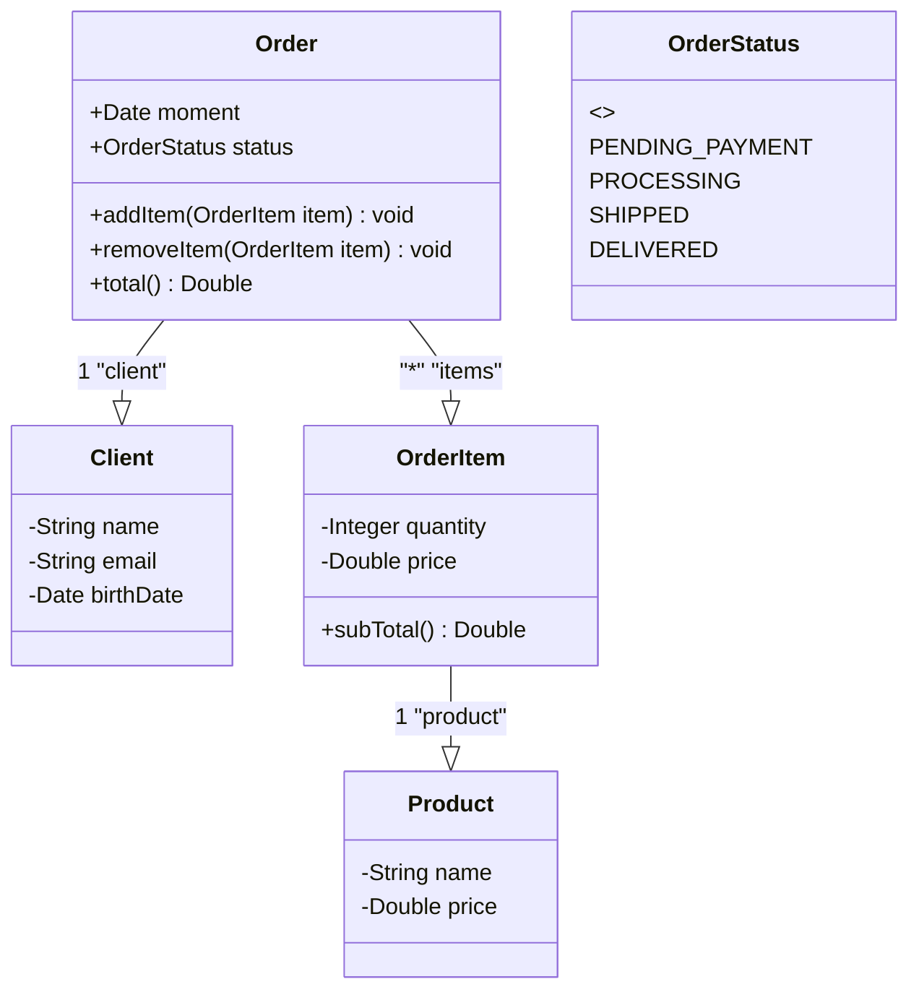

#### Diagrama de Serviços (Exemplo Genérico)

```mermaid
classDiagram
    <<interface>> CrudRepository
    CrudRepository : +save(T obj) T
    CrudRepository : +delete(T obj) void
    CrudRepository : +findById(ID id) T
    CrudRepository : +findAll() List~T~
    OrderRepository --|> CrudRepository
    OrderRepository : +findByDate(Date minDate, Date maxDate) List~Order~
    OrderService ..> OrderRepository : -repository
    OrderService : +save(Order order) void
    OrderService : +search(Date minDate, Date maxDate) List~Order~
    AuthService ..> EmailService : -emailService
    AuthService : +getToken(String username, String password) String
    AuthService : +refreshToken(String token) String
    AuthService : +sendNewPassword(String email) void
    EmailService : +sendEmail(String sender, String recipient, String subject, String message) void
```

#### Design da Camada de Domínio (Problema da Locadora)

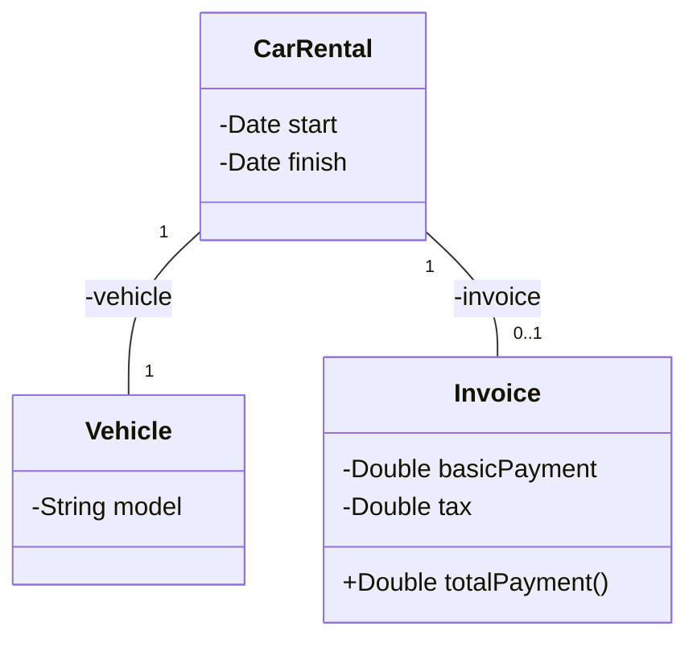

#### Design da Camada de Serviço (Sem Interface)

Nesta abordagem, `ServicoAluguel` depende diretamente de uma classe concreta `ServicoImpostoBrasil`.

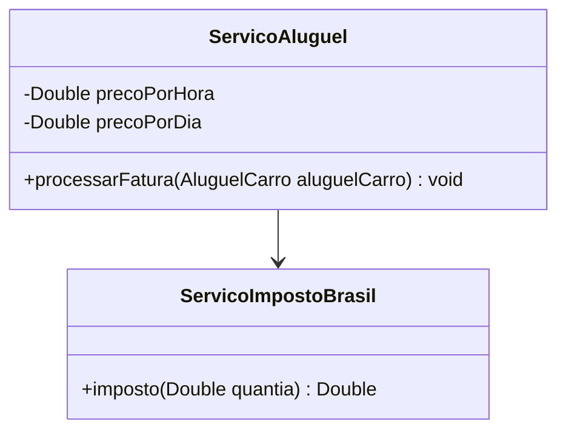

Isso leva a um **acoplamento forte**:

* A classe `ServicoAluguel` conhece a dependência concreta (`ServicoImpostoBrasil`).
* Se a classe concreta mudar (por exemplo, para `ServicoImpostoEUA`), é preciso mudar a classe `ServicoAluguel`.

<!-- end list -->

```java
// Exemplo de acoplamento forte
class ServicoAluguel {
    // ...
    private ServicoImpostoBrasil servicoImposto; // Dependência concreta
    // ...
}
```

#### Design da Camada de Serviço (Com Interface)

Aqui, `ServicoAluguel` depende de uma abstração (interface `ServicoImposto`). `ServicoImpostoBrasil` é uma implementação dessa interface.

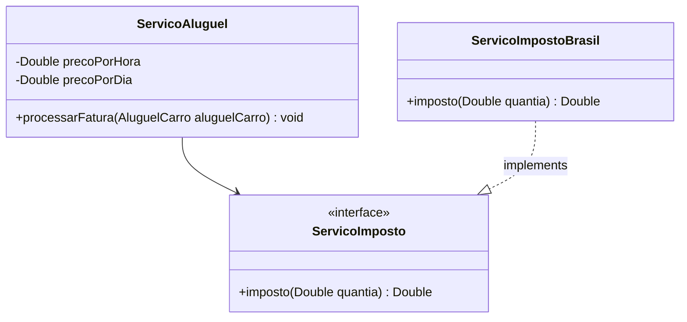

Isso promove um **acoplamento fraco**:

* A classe `ServicoAluguel` não conhece a dependência concreta, apenas a interface `ServicoImposto`.
* Se a classe concreta mudar (por exemplo, introduzindo `ServicoImpostoEUA`), a classe `ServicoAluguel` não muda nada, desde que a nova classe implemente `ServicoImposto`.

<!-- end list -->

```java
// Exemplo de acoplamento fraco
class ServicoAluguel {
    // ...
    private ServicoImposto servicoImposto; // Dependência via interface
    // ...
}
```

## 🔄 Inversão de Controle e Injeção de Dependência

### Inversão de Controle (IoC)

É um padrão de desenvolvimento que consiste em **retirar da classe a responsabilidade de instanciar suas dependências**. Em vez da classe controlar a criação e o ciclo de vida de seus objetos dependentes, essa responsabilidade é delegada a um contêiner ou a um componente externo.

### Injeção de Dependência (ID)

É uma forma de realizar a inversão de controle: um componente externo instancia a dependência, que é então **injetada** no objeto "pai". A injeção de dependência permite que o acoplamento entre os componentes seja reduzido.

Pode ser implementada de várias formas:

* **Construtor**: As dependências são passadas como parâmetros para o construtor da classe.
* **Métodos Setters**: As dependências são injetadas através de métodos `set`.
* **Interface**: A classe implementa uma interface com um método para injetar a dependência.
* **Classe de instanciação (Builder / Factory)**: Padrões de projeto que encapsulam a lógica de criação de objetos.
* **Container/Framework**: Frameworks como Spring IoC Container gerenciam automaticamente a criação e injeção de dependências.

#### Injeção de Dependência por Meio de Construtor

```java
package programa;

import servicos.ServicoAluguel;
import servicos.ServicoImpostoBrasil; // Implementação concreta

// Supondo que as classes estão em pacotes apropriados
// import entidades.AluguelCarro;
// import java.time.LocalDateTime;
// import java.time.format.DateTimeFormatter;
// import java.util.Locale;
// import java.util.Scanner;

public class Programa {

    public static void main(String[] args) {
        // ... leitura de dados ...
        double precoPorHora = 10.0;
        double precoPorDia = 130.0;

        // A dependência ServicoImpostoBrasil é explicitamente instanciada
        // e injetada no construtor de ServicoAluguel.
        // Ocorre um UPCASTING: ServicoImpostoBrasil é um ServicoImposto.
        ServicoAluguel servicoAluguel = new ServicoAluguel(precoPorHora, precoPorDia, new ServicoImpostoBrasil());

        // ... resto do código para processar a fatura ...
    }
}
```

```java
package servicos;

// import entidades.AluguelCarro;
// import entidades.Fatura;
// import java.time.Duration;

// Interface para o serviço de imposto
interface ServicoImposto {
    double imposto(double quantia);
}

// Implementação brasileira do serviço de imposto
class ServicoImpostoBrasil implements ServicoImposto {
    public double imposto(double quantia) {
        if (quantia <= 100.0) {
            return quantia * 0.20;
        } else {
            return quantia * 0.15;
        }
    }
}

public class ServicoAluguel {
    private double precoPorHora;
    private double precoPorDia;

    private ServicoImposto servicoImposto; // Depende da interface

    // A dependência é injetada via construtor
    public ServicoAluguel(double precoPorHora, double precoPorDia, ServicoImposto servicoImposto) {
        this.precoPorHora = precoPorHora;
        this.precoPorDia = precoPorDia;
        this.servicoImposto = servicoImposto;
    }

    /*
    public void processarFatura(AluguelCarro aluguelCarro) {
        long minutos = Duration.between(aluguelCarro.getInicio(), aluguelCarro.getFim()).toMinutes();
        double horas = (double) minutos / 60.0;
        double pagamentoBasico;

        if (horas <= 12.0) {
            pagamentoBasico = Math.ceil(horas) * precoPorHora;
        } else {
            pagamentoBasico = Math.ceil(horas / 24.0) * precoPorDia;
        }

        double imposto = servicoImposto.imposto(pagamentoBasico);
        aluguelCarro.setFatura(new Fatura(pagamentoBasico, imposto));
    }
    */
}
```

## 📝 Exercício de Fixação: Processamento de Contratos

Uma empresa deseja automatizar o processamento de seus contratos. O processamento de um contrato consiste em gerar as parcelas a serem pagas para aquele contrato, com base no número de meses desejado.

A empresa utiliza um serviço de pagamento online para realizar o pagamento das parcelas. Os serviços de pagamento online tipicamente cobram um juro mensal, bem como uma taxa por pagamento. Por enquanto, o serviço contratado pela empresa é o do Paypal, que aplica juros simples de 1% a cada parcela, mais uma taxa de pagamento de 2%.

Fazer um programa para ler os dados de um contrato (número do contrato, data do contrato, e valor total do contrato). Em seguida, o programa deve ler o número de meses para parcelamento do contrato, e daí gerar os registros de parcelas a serem pagas (data e valor), sendo a primeira parcela a ser paga um mês após a data do contrato, a segunda parcela dois meses após o contrato e assim por diante. Mostrar os dados das parcelas na tela.

**Exemplo:**

Dados do contrato:
Número: 8028
Data (dd/MM/yyyy): 25/06/2018
Valor do contrato: 600.00
Número de parcelas: 3

Parcelas:
25/07/2018 - 206.04
25/08/2018 - 208.08
25/09/2018 - 210.12

Cálculos (1% de juro simples mensal + 2% de taxa de pagamento):
Valor base da parcela = 600.00 / 3 = 200.00

Parcela \#1:
Juro = 200.00 \* 1% \* 1 = 2.00
Valor com juro = 200.00 + 2.00 = 202.00
Taxa de pagamento = 202.00 \* 2% = 4.04
Valor final Parcela \#1 = 202.00 + 4.04 = 206.04

Parcela \#2:
Juro = 200.00 \* 1% \* 2 = 4.00
Valor com juro = 200.00 + 4.00 = 204.00
Taxa de pagamento = 204.00 \* 2% = 4.08
Valor final Parcela \#2 = 204.00 + 4.08 = 208.08

Parcela \#3:
Juro = 200.00 \* 1% \* 3 = 6.00
Valor com juro = 200.00 + 6.00 = 206.00
Taxa de pagamento = 206.00 \* 2% = 4.12
Valor final Parcela \#3 = 206.00 + 4.12 = 210.12

### Design da Camada de Domínio (Entidades)

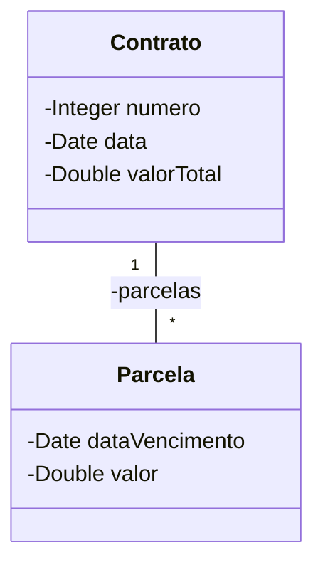

### Projeto dos Serviços

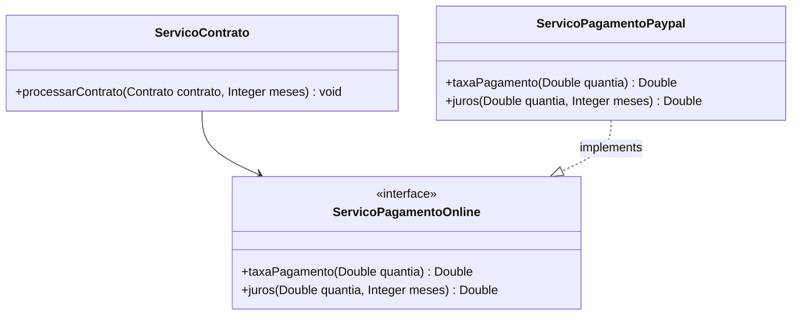

**O que o método `processarContrato` deve fazer?**
Para cada mês de parcelamento:

1.  Calcular o valor base da parcela (valor total do contrato / número de meses).
2.  Calcular o juro mensal sobre o valor base da parcela (usando o `ServicoPagamentoOnline`).
3.  Somar o juro ao valor base.
4.  Calcular a taxa de pagamento sobre o valor com juro (usando o `ServicoPagamentoOnline`).
5.  Somar a taxa de pagamento para obter o valor final da parcela.
6.  Adicionar a nova parcela (com data de vencimento e valor) à lista de parcelas do contrato.

## 🆚 Herdar vs. Cumprir Contrato (Interface)

**Aspectos em comum entre herança (classes) e interfaces:**

* **Relação "é-um"**: Um `Retangulo` *é uma* `Forma`, um `ServicoImpostoBrasil` *é um* `ServicoImposto`.
* **Generalização/Especialização**: `Forma` é uma generalização, `Retangulo` é uma especialização. `ServicoImposto` é uma generalização, `ServicoImpostoBrasil` é uma especialização de comportamento.
* **Polimorfismo**: Capacidade de um objeto assumir diferentes formas. Podemos tratar objetos de `Retangulo` e `Circulo` genericamente como `Forma`. Da mesma forma, podemos tratar `ServicoImpostoBrasil` ou `ServicoImpostoEUA` genericamente como `ServicoImposto`.

**Diagrama de Herança (Classes):**

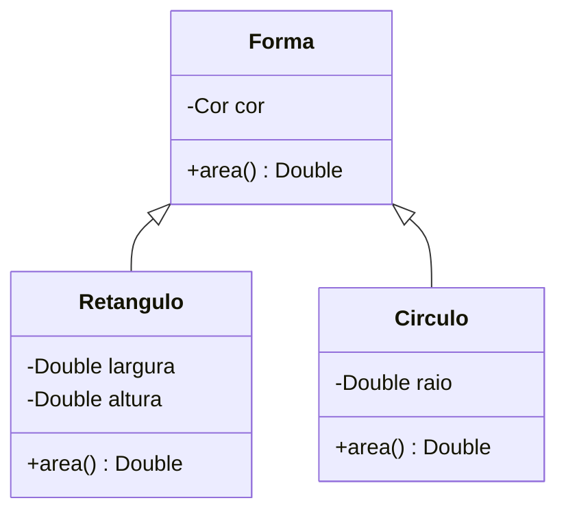

**Diagrama de Implementação (Interfaces):**

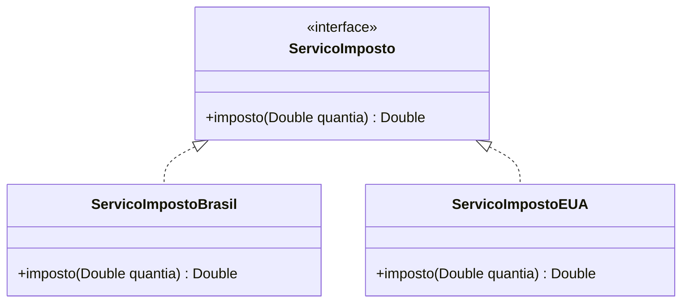

### ⚖️ Diferença Fundamental

* **Herança (de classe):** Principal objetivo é o **reuso de código** (atributos e métodos) e o estabelecimento de uma hierarquia de tipos forte. Uma classe pode herdar de apenas uma superclasse em Java (herança simples).
* **Interface:** Principal objetivo é definir um **contrato a ser cumprido**. Especifica um conjunto de métodos que uma classe deve implementar. Uma classe pode implementar múltiplas interfaces. Não há reuso de implementação (antes do Java 8).

**E se eu precisar implementar `Forma` como interface, porém também quiser definir uma estrutura comum reutilizável para todas as figuras (ex: um atributo `cor`)?**

Pode-se usar uma combinação: uma interface para o contrato e uma classe abstrata para o reuso comum.

```mermaid
classDiagram
    <<interface>> IForma
    IForma : +area() Double
    AbstractForma ..|> IForma : implements
    AbstractForma <|-- Retangulo
    AbstractForma <|-- Circulo
    AbstractForma : -Cor cor
    Retangulo : -Double largura
    Retangulo : -Double altura
    Retangulo : +area() Double
    Circulo : -Double raio
    Circulo : +area() Double
```

Neste caso, `AbstractForma` implementaria `IForma` e forneceria o atributo `cor`. `Retangulo` e `Circulo` herdariam de `AbstractForma` e implementariam o método `area()`.

### 📧 Outro Exemplo: Serviço de Email

```mermaid
classDiagram
    <<interface>> ServicoEmail
    ServicoEmail : +enviarEmail(MensagemEmailSimples mensagem) void
    ServicoEmail : +enviarEmailConfirmacaoPedido(Pedido pedido) void
    AbstractServicoEmail ..|> ServicoEmail
    AbstractServicoEmail <|-- ServicoEmailMock
    AbstractServicoEmail <|-- ServicoEmailSmtp
    AbstractServicoEmail : +prepararMensagemEmailSimplesDePedido(Pedido pedido) MensagemEmailSimples
    AbstractServicoEmail : +enviarEmailConfirmacaoPedido(Pedido pedido) void
    ServicoEmailMock : +enviarEmail(MensagemEmailSimples mensagem) void
    ServicoEmailSmtp : +enviarEmail(MensagemEmailSimples mensagem) void
```

* `ServicoEmail`: Interface definindo o contrato para envio de emails.
* `AbstractServicoEmail`: Classe abstrata que implementa `ServicoEmail`. Pode fornecer implementações comuns, como `enviarEmailConfirmacaoPedido` que usa `prepararMensagemEmailSimplesDePedido` e depois chama o método abstrato `enviarEmail` (a ser implementado pelas subclasses).
* `ServicoEmailMock`: Implementação para testes, não envia emails reais.
* `ServicoEmailSmtp`: Implementação real que envia emails via SMTP.

## 💎 Herança Múltipla e o Problema do Diamante

A **herança múltipla** (uma classe herdando de múltiplas superclasses) pode gerar o **problema do diamante**: uma ambiguidade causada pela existência do mesmo método (com a mesma assinatura) em mais de uma superclasse.

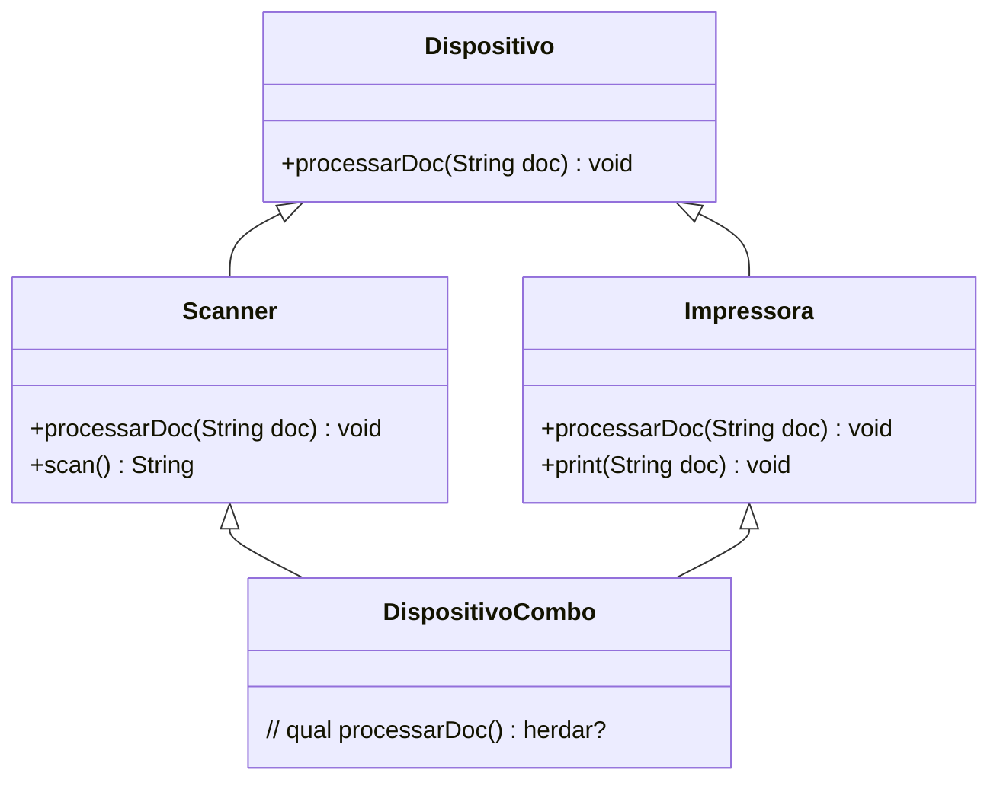

Se `DispositivoCombo` herda de `Scanner` e `Impressora`, e ambas têm um método `processarDoc`, qual versão `DispositivoCombo` usaria?

**A herança múltipla de classes não é permitida na maioria das linguagens orientadas a objetos, incluindo Java, justamente para evitar este e outros problemas de complexidade.**

### Implementando Múltiplas Interfaces

Porém, **uma classe pode implementar mais de uma interface**.

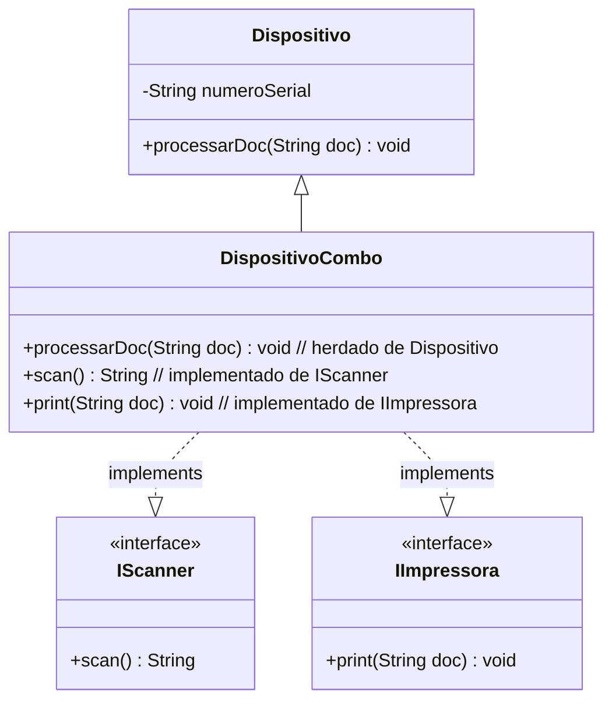

**ATENÇÃO:**
Isso **NÃO é herança múltipla de implementação**, pois NÃO HÁ REUSO de código das interfaces `IScanner` e `IImpressora` (antes do Java 8 com default methods). `DispositivoCombo` não *herda* implementação das interfaces, mas sim *implementa* os métodos definidos por elas (cumpre o contrato). Se as interfaces tivessem métodos default com a mesma assinatura, a classe `DispositivoCombo` seria obrigada a sobrescrever o método para resolver a ambiguidade.

## ⚖️ Interface `Comparable`

A interface `java.lang.Comparable<T>` é usada para impor uma ordem natural aos objetos de uma classe que a implementa.

```java
public interface Comparable<T> {
    int compareTo(T outroObjeto);
}
```

O método `compareTo(T outroObjeto)` compara este objeto com o `outroObjeto` especificado.
**Retorna:**

* Um **inteiro negativo** se este objeto for menor que `outroObjeto`.
* **Zero** se este objeto for igual a `outroObjeto`.
* Um **inteiro positivo** se este objeto for maior que `outroObjeto`.

Classes como `String`, `Integer`, `Double`, `Date` já implementam `Comparable`. Isso permite que listas ou arrays desses objetos sejam facilmente ordenados usando `Collections.sort()` ou `Arrays.sort()`.

**Exemplo com Strings:**

```java
System.out.println("maria".compareTo("alex"));   // Saída: 12 (m vem depois de a)
System.out.println("alex".compareTo("maria"));   // Saída: -12 (a vem antes de m)
System.out.println("maria".compareTo("maria")); // Saída: 0 (iguais)
```

### 📂 Problema Motivador: Ordenar Nomes de um Arquivo

Faça um programa para ler um arquivo contendo nomes de pessoas (um nome por linha), armazenando-os em uma lista. Depois, ordenar os dados dessa lista e mostrá-los ordenadamente na tela.
Nota: o caminho do arquivo pode ser informado "hardcoded".

**Arquivo `entrada.txt` (exemplo):**

```
Maria Brown
Alex Green
Bob Grey
Anna White
Alex Black
Eduardo Rose
Willian Red
Marta Blue
Alex Brown
```

**Código Java:**
Este código funcionará em qualquer IDE Java como VS Code ou IntelliJ IDEA. Certifique-se de que o arquivo `entrada.txt` exista no caminho especificado ou ajuste o caminho.

```java
package aplicacao;

import java.io.BufferedReader;
import java.io.FileReader;
import java.io.IOException;
import java.util.ArrayList;
import java.util.Collections; // Para o método sort
import java.util.List;

public class Programa {

    public static void main(String[] args) {
        List<String> listaNomes = new ArrayList<>();
        String caminhoArquivo = "C:\\temp\\entrada.txt"; // Adapte este caminho

        try (BufferedReader br = new BufferedReader(new FileReader(caminhoArquivo))) {
            String nome = br.readLine();
            while (nome != null) {
                listaNomes.add(nome);
                nome = br.readLine();
            }

            Collections.sort(listaNomes); // String implementa Comparable

            for (String s : listaNomes) {
                System.out.println(s);
            }
        } catch (IOException e) {
            System.out.println("Erro: " + e.getMessage());
        }
    }
}
```

**Saída Esperada (ordenada):**

```
Alex Black
Alex Brown
Alex Green
Anna White
Bob Grey
Eduardo Rose
Maria Brown
Marta Blue
Willian Red
```

### 🧑‍💼 Outro Problema: Ordenar Funcionários de um CSV

Faça um programa para ler um arquivo contendo funcionários (nome e salário) no formato .csv, armazenando-os em uma lista. Depois, ordenar a lista por nome e mostrar o resultado na tela.
Nota: o caminho do arquivo pode ser informado "hardcoded".

**Arquivo `funcionarios.csv` (exemplo):**

```
Maria Brown,4300.00
Alex Green,3100.00
Bob Grey,3100.00
Anna White,3500.00
Alex Black,2450.00
Eduardo Rose,4390.00
Willian Red,2900.00
Marta Blue,6100.00
Alex Brown,5000.00
```

Para ordenar uma lista de objetos `Funcionario` por nome, a classe `Funcionario` deve implementar `Comparable<Funcionario>`.

**Classe `Funcionario`:**

```java
package entidades;

public class Funcionario implements Comparable<Funcionario> {
    private String nome;
    private Double salario;

    public Funcionario(String nome, Double salario) {
        this.nome = nome;
        this.salario = salario;
    }

    public String getNome() {
        return nome;
    }

    public void setNome(String nome) {
        this.nome = nome;
    }

    public Double getSalario() {
        return salario;
    }

    public void setSalario(Double salario) {
        this.salario = salario;
    }

    // Implementação do método compareTo para ordenar por nome
    @Override
    public int compareTo(Funcionario outro) {
        return this.nome.compareTo(outro.getNome());
    }

    @Override
    public String toString() {
        return nome + "," + String.format("%.2f", salario);
    }
}
```

**Programa Principal:**

```java
package aplicacao;

import java.io.BufferedReader;
import java.io.FileReader;
import java.io.IOException;
import java.util.ArrayList;
import java.util.Collections;
import java.util.List;
import entidades.Funcionario; // Importa a classe Funcionario

public class ProgramaLeituraFuncionarios {

    public static void main(String[] args) {
        List<Funcionario> listaFuncionarios = new ArrayList<>();
        String caminhoArquivo = "C:\\temp\\funcionarios.csv"; // Adapte este caminho

        try (BufferedReader br = new BufferedReader(new FileReader(caminhoArquivo))) {
            String linhaCsvFuncionario = br.readLine();
            while (linhaCsvFuncionario != null) {
                String[] campos = linhaCsvFuncionario.split(",");
                String nome = campos[0];
                double salario = Double.parseDouble(campos[1]);
                listaFuncionarios.add(new Funcionario(nome, salario));
                linhaCsvFuncionario = br.readLine();
            }

            Collections.sort(listaFuncionarios); // Funcionario agora é Comparable

            for (Funcionario func : listaFuncionarios) {
                System.out.println(func); // Usa o toString() de Funcionario
            }
        } catch (IOException e) {
            System.out.println("Erro: " + e.getMessage());
        }
    }
}
```

## 🆕 Default Methods (Métodos Padrão)

A partir do **Java 8**, interfaces podem conter **métodos concretos**, chamados de *default methods* (ou *defender methods*).

**Intenção básica:**
Prover implementação padrão para métodos, de modo a evitar:

1.  Repetição de implementação em toda classe que implemente a interface.
2.  A necessidade de se criar classes abstratas apenas para prover reuso de implementação de alguns métodos.

**Outras Vantagens:**

* **Manter a retrocompatibilidade**: Adicionar novos métodos a interfaces existentes sem quebrar o código das classes que já as implementam. As classes existentes herdarão a implementação padrão.
* **Permitir que "interfaces funcionais"** (que devem conter apenas um método abstrato para serem usadas com expressões lambda) possam prover outras operações padrão reutilizáveis. Exemplo: `java.util.function.Predicate` possui métodos default como `and()`, `or()`, `negate()`.

### 🏦 Problema Exemplo: Serviço de Juros

Fazer um programa para ler uma quantia e a duração em meses de um empréstimo. Informar o valor a ser pago depois de decorrido o prazo do empréstimo, conforme regras de juros do Brasil. A regra de cálculo de juros do Brasil é juro composto padrão de 2% ao mês.

**Exemplo:**
Quantia: 200.00
Meses: 3
Pagamento após 3 meses: 212.2416 (aproximadamente 212.24)

Cálculos: Pagamento = Quantia \* (1 + taxaDeJuros / 100)\<sup\>Meses\</sup\>
Pagamento = 200.00 \* (1 + 2/100)\<sup\>3\</sup\> = 200.00 \* (1.02)\<sup\>3\</sup\> = 200.00 \* 1.061208 = 212.2416

**Design Inicial (Sem Default Method):**

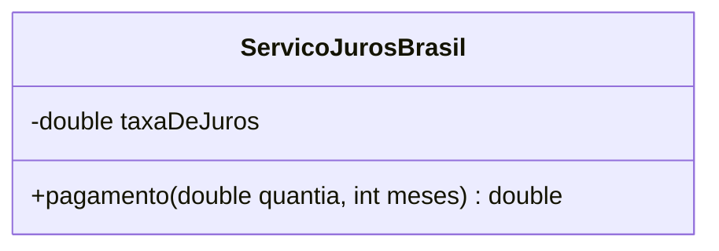

Se quisermos adicionar um serviço de juros de outro país (EUA, com 1% ao mês):

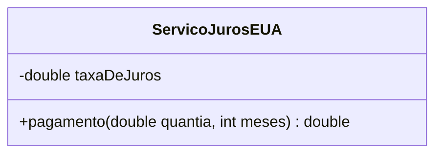

A lógica do método `pagamento` é a mesma, apenas a `taxaDeJuros` muda. Podemos usar uma interface com um método `getTaxaDeJuros()` e um método `pagamento()`.

```mermaid
classDiagram
    <<interface>> ServicoJuros
    ServicoJuros : +getTaxaDeJuros() double
    ServicoJuros : +pagamento(double quantia, int meses) double
    ServicoJurosBrasil ..|> ServicoJuros
    ServicoJurosEUA ..|> ServicoJuros
```

Neste caso, tanto `ServicoJurosBrasil` quanto `ServicoJurosEUA` teriam que implementar o método `pagamento` de forma idêntica.

### Utilizando Default Method na Interface `ServicoJuros`

Com default methods, podemos fornecer uma implementação padrão para o método `pagamento` diretamente na interface.

```java
package servicos;

// Interface com default method
interface ServicoJuros {
    double getTaxaDeJuros(); // Método abstrato a ser implementado

    // Default method com implementação padrão
    default double pagamento(double quantia, int meses) {
        if (meses < 1) {
            throw new IllegalArgumentException("Meses deve ser maior ou igual a 1");
        }
        return quantia * Math.pow(1.0 + getTaxaDeJuros() / 100.0, meses);
    }
}

// Implementação para o Brasil
class ServicoJurosBrasil implements ServicoJuros {
    private double taxaDeJuros;

    public ServicoJurosBrasil(double taxaDeJuros) {
        this.taxaDeJuros = taxaDeJuros;
    }

    @Override
    public double getTaxaDeJuros() {
        return taxaDeJuros;
    }
}

// Implementação para os EUA
class ServicoJurosEUA implements ServicoJuros {
    private double taxaDeJuros;

    public ServicoJurosEUA(double taxaDeJuros) {
        this.taxaDeJuros = taxaDeJuros;
    }

    @Override
    public double getTaxaDeJuros() {
        return taxaDeJuros;
    }
}

public class ProgramaJuros {
    public static void main(String[] args) {
        ServicoJuros sjBrasil = new ServicoJurosBrasil(2.0); // 2%
        ServicoJuros sjEUA = new ServicoJurosEUA(1.0);    // 1%

        double quantia = 200.00;
        int meses = 3;

        System.out.printf("Pagamento Brasil (quantia: %.2f, meses: %d): %.2f%n",
                quantia, meses, sjBrasil.pagamento(quantia, meses));

        System.out.printf("Pagamento EUA (quantia: %.2f, meses: %d): %.2f%n",
                quantia, meses, sjEUA.pagamento(quantia, meses));
    }
}
```

**Saída do `ProgramaJuros`:**

```
Pagamento Brasil (quantia: 200.00, meses: 3): 212.24
Pagamento EUA (quantia: 200.00, meses: 3): 206.06
```

As classes `ServicoJurosBrasil` e `ServicoJurosEUA` só precisam implementar `getTaxaDeJuros()`, herdando a lógica de `pagamento()` da interface.

### 🤔 Considerações Importantes sobre Default Methods

* **Reuso**: Sim, agora as interfaces podem prover reuso de código (comportamento).
* **"Herança Múltipla"**: Sim, agora temos uma forma de "herança múltipla" de comportamento (uma classe pode implementar múltiplas interfaces e herdar default methods de cada uma).
    * **Conflitos**: O compilador reclama se houver mais de um default method com a **mesma assinatura** vindo de diferentes interfaces implementadas pela classe. Nesse caso, a classe é **obrigada a sobrescrever** o método para resolver a ambiguidade e especificar qual implementação usar, ou fornecer uma nova.
* **Diferença para Classes Abstratas**: Interfaces ainda são bem diferentes de classes abstratas.
    * Interfaces **não possuem atributos de instância** (campos). Elas podem ter constantes ( `static final` ).
    * Interfaces **não possuem construtores**.
    * Uma classe pode herdar de apenas uma classe (abstrata ou concreta), mas pode implementar múltiplas interfaces.

Default methods são um recurso poderoso para a evolução de APIs e para a escrita de código mais conciso e reutilizável, especialmente quando combinados com interfaces funcionais e expressões lambda.

---
## 📚