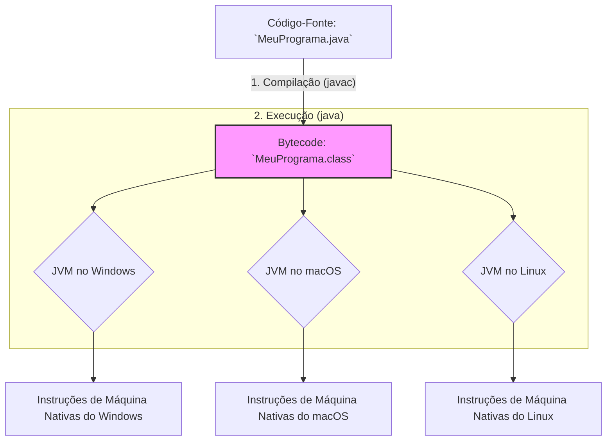

# ☕ Java: A Linguagem da Robustez e Portabilidade

Java é uma linguagem de programação de alto nível, orientada a objetos, e fortemente tipada, desenvolvida originalmente por James Gosling na Sun Microsystems e lançada em 1995. Hoje mantida pela Oracle, Java foi projetada com uma filosofia central que a tornou uma das linguagens mais populares e duradouras do mundo, especialmente no ambiente corporativo.

Sua principal promessa é a de ser uma linguagem de programação para a qual você pode escrever um programa uma vez e, em seguida, executá-lo em qualquer dispositivo, independentemente do sistema operacional.

---

## 🔗 Tópicos

* **[Tópicos](/topicos.md)**: Trilhas de Aprendizagem.

-----

## 📜 O Princípio "WORA": Escreva Uma Vez, Rode em Qualquer Lugar

O famoso lema do Java é **"Write Once, Run Anywhere" (WORA)**. Essa portabilidade mágica é alcançada através da **JVM (Java Virtual Machine)**.

### A JVM (Java Virtual Machine)

Diferente de linguagens como C++, o compilador Java (`javac`) não converte o código-fonte diretamente para o código de máquina nativo do sistema operacional. Em vez disso, ele o compila para um formato intermediário e universal chamado **bytecode**.

### Bytecode

O bytecode é um conjunto de instruções altamente otimizado que não é específico de nenhum processador. A JVM atua como um "mini sistema operacional" ou um interpretador que traduz esse bytecode universal para as instruções de máquina nativas da plataforma em que está sendo executado (Windows, macOS, Linux, etc.).

É essa camada de abstração (a JVM) que garante que o mesmo arquivo de bytecode (`.class`) possa ser executado em qualquer lugar que tenha uma JVM instalada, cumprindo a promessa do WORA.

-----

## ⚙️ Compilação e Execução: O Papel da JVM

O fluxo de um programa Java, do código-fonte à execução, envolve duas etapas distintas, como ilustrado abaixo.



-----

## ✨ Características Principais

### Fortemente Orientado a Objetos (OOP)

Java é uma das linguagens que mais rigorosamente implementa o paradigma de programação orientada a objetos. Praticamente tudo em Java é um objeto, e todo código reside dentro de uma classe. Os pilares de Encapsulamento, Herança e Polimorfismo são centrais para a linguagem.

### Fortemente Tipado e Estático

Todas as variáveis e expressões têm um tipo que é verificado em tempo de compilação. Isso força o desenvolvedor a ser explícito sobre os tipos de dados, o que resulta em um código mais seguro e robusto, detectando muitos erros antes mesmo da execução do programa.

### Gerenciamento Automático de Memória (Garbage Collector)

Desenvolvedores Java não precisam se preocupar em alocar e liberar memória manualmente, como em C/C++. A JVM possui um processo automático chamado **Garbage Collector (GC)**, que periodicamente identifica e libera a memória usada por objetos que não estão mais em uso, prevenindo a maioria dos vazamentos de memória.

### Verboso, mas Explícito

Java é conhecido por sua sintaxe verbosa. O famoso `public static void main(String[] args)` é um exemplo. No entanto, essa verbosidade é uma troca deliberada por clareza e legibilidade. O código Java tende a ser explícito, o que é altamente valorizado em grandes projetos corporativos mantidos por equipes ao longo de muitos anos.

-----

## 📦 O Vasto Ecossistema Java

O sucesso de Java também se deve ao seu ecossistema maduro e gigantesco.

  - **JDK, JRE e JVM**:
      - **JVM (Java Virtual Machine)**: O componente que executa o bytecode.
      - **JRE (Java Runtime Environment)**: O ambiente necessário para *rodar* aplicações Java (inclui a JVM e bibliotecas padrão).
      - **JDK (Java Development Kit)**: O kit completo para *desenvolver* em Java (inclui o JRE, o compilador `javac` e outras ferramentas).
  - **Ferramentas de Build**: **Maven** e **Gradle** são os gerenciadores de dependências e ferramentas de automação de build padrão do ecossistema, facilitando a gestão de bibliotecas e a compilação de projetos.
  - **Spring Framework**: É o framework mais dominante no mundo Java, especialmente com o **Spring Boot**. Ele simplifica drasticamente a criação de aplicações web, APIs REST e microserviços robustos e de alto desempenho, sendo o padrão de fato para o desenvolvimento backend corporativo.

-----

## 🎯 Onde o Java é Rei?

Java é uma escolha popular para aplicações que exigem alta performance, estabilidade e escalabilidade.

  - **Aplicações Corporativas (Enterprise)**: Este é o seu principal domínio. Grandes sistemas bancários, plataformas de e-commerce, sistemas de gestão de risco e aplicações de grande escala em corporações globais.
  - **Desenvolvimento Android**: Por muitos anos, Java foi a linguagem principal para o desenvolvimento de aplicativos nativos para Android (hoje, divide o posto com Kotlin, que também roda na JVM).
  - **Sistemas de Big Data**: Muitas ferramentas líderes no ecossistema de Big Data, como Hadoop, Spark e Kafka, são escritas em Java ou em outras linguagens da JVM.
  - **Aplicações Científicas e Financeiras**: Usado em sistemas de simulação e plataformas de negociação de alta frequência (*high-frequency trading*) devido à sua performance otimizada pela JIT (compilação just-in-time) da JVM.
  - **Serviços Web e APIs de Larga Escala**: Graças ao Spring Boot, construir APIs RESTful robustas e escaláveis é uma das maiores forças do Java hoje.

-----

## 🚀 Começando com Java

1.  **Instale o JDK**: Para desenvolver em Java, você precisa instalar o **JDK (Java Development Kit)**. Você pode baixar de fontes como a Oracle ou usar distribuições OpenJDK como a da Adoptium (Eclipse Temurin).
2.  **Escreva o "Olá, Mundo\!"**: Crie um arquivo chamado `HelloWorld.java`. O nome do arquivo **deve** ser idêntico ao nome da classe pública.
    ```java
    // HelloWorld.java

    // Todo código Java deve estar dentro de uma classe.
    public class HelloWorld {
        
        // O método 'main' é o ponto de entrada de toda aplicação Java.
        public static void main(String[] args) {
            // System.out.println() imprime uma linha no console.
            System.out.println("Olá, Mundo Robusto com Java!");
        }
    }
    ```
3.  **Compile e Execute** no terminal:
    ```sh
    # 1. Compila o código-fonte para bytecode
    javac HelloWorld.java

    # 2. Executa o bytecode na JVM
    java HelloWorld
    ```

---

## ✉️ Contatos

* **[Contatos](https://ricardotecpro.github.io/contatos.html)**: Contatos / Contacts

---

### 📌 [ricardotecpro.github.io](https://ricardotecpro.github.io/)
