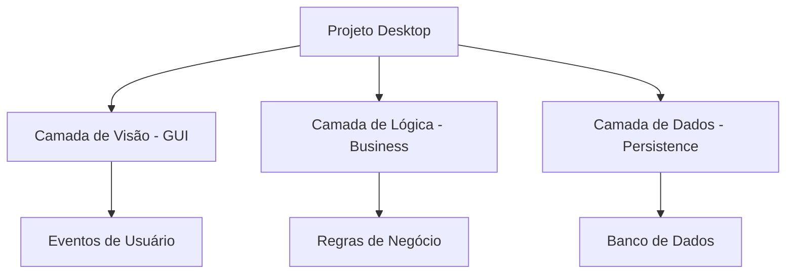

# Aula 01 - Introdução ao Desenvolvimento Desktop 🖥️

Bem-vindo à primeira aula do curso de Desenvolvimento Desktop! Nesta aula, vamos entender o que é o desenvolvimento de aplicações voltadas para o ambiente de desktop e como configurar nosso ambiente.

## 😊 O que é Software Desktop?

Sistemas desktop são aplicações instaladas diretamente no sistema operacional (Windows, macOS, Linux) de um computador. Diferente das aplicações web, elas rodam localmente e têm acesso direto ao hardware e arquivos do sistema.

### Exemplos de Aplicações
*   **ERP (Enterprise Resource Planning):** Sistemas de gestão empresarial.
*   **PDV (Ponto de Venda):** Sistemas de caixa de supermercados e lojas.
*   **Sistemas Acadêmicos:** Para controle de notas e faltas.
*   **Editores de Imagem/Vídeo:** Como Photoshop ou Premiere.

## 📊 Estrutura de um Projeto



## 🧠 Conceitos Importantes

> [!NOTE]
> **Compilação:** É o processo de transformar o código fonte (escrito em Java, C#, etc.) em um formato que o computador entenda (Bytecode ou Binário).

> [!TIP]
> **IDE:** Utilizaremos o IntelliJ IDEA ou Eclipse para facilitar o desenvolvimento, depuração e execução dos nossos programas.

## 💻 Primeiro Programa

Vamos ver como é a estrutura básica de um programa Java executado via terminal.

<!-- termynal -->
```bash
$ javac PrimeiroPrograma.java
$ java PrimeiroPrograma
Olá, Mundo Desktop! 🚀
```

## 📝 Exercícios Progressivos

1.  **Básico:** Explique a principal diferença entre uma aplicação Web e uma aplicação Desktop.
2.  **Básico:** Pesquise e cite 3 softwares desktop que você utiliza no dia a dia.
3.  **Intermediário:** O que acontece quando clicamos no botão "Build" ou "Run" em uma IDE?
4.  **Intermediário:** Por que sistemas de PDV (caixas de mercado) ainda são majoritariamente desktop?
5.  **Desafio:** Crie um diagrama simples (pode ser no papel ou Mermaid) representando a interação entre um usuário e um sistema de login desktop.

🚀 **Mini-projeto:** Configure o ambiente Java em sua máquina e execute o clássico "Hello World" no terminal.
