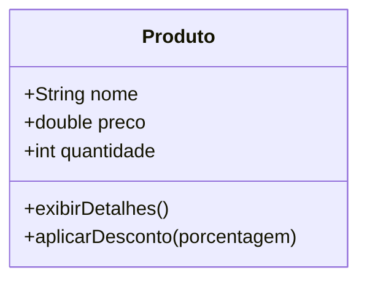

# Aula 02 - Classes, Objetos e Instanciação 🧱

Hoje vamos mergulhar no coração da Programação Orientada a Objetos (POO): as Classes e os Objetos.

## 😊 Conceito de Classe e Objeto

Imagine que uma **Classe** é uma planta de uma casa. Ela define onde ficam as janelas, o tamanho dos quartos, etc. O **Objeto** é a casa construída a partir dessa planta.

*   **Classe:** O molde/modelo.
*   **Objeto:** A instância real do modelo.

### Atributos e Métodos
*   **Atributos:** Características do objeto (ex: cor, peso, preço).
*   **Métodos:** Ações que o objeto pode realizar (ex: acelerar, salvar, calcular).

## 📊 Modelagem de Produto



## 🧠 Exemplo Prático de Instanciação

> [!IMPORTANT]
> A palavra-chave `new` é utilizada para criar (instanciar) um novo objeto a partir de uma classe.

```java
// Criando o objeto
Produto p1 = new Produto();
p1.nome = "Teclado Mecânico";
p1.preco = 250.00;

// Chamando um método
p1.exibirDetalhes();
```

## 📝 Exercícios Progressivos

1.  **Básico:** Defina com suas palavras o que é uma Classe.
2.  **Básico:** Diferencie Atributo de Método.
3.  **Intermediário:** Crie uma modelagem simples (Lista de atributos e métodos) para uma classe `Cliente`.
4.  **Intermediário:** Se tivermos a classe `Cachorro`, cite 3 possíveis atributos e 2 métodos.
5.  **Desafio:** Desenhe um diagrama Mermaid para uma classe `ContaBancaria` com atributos como `saldo` e métodos como `depositar` e `sacar`.

🚀 **Mini-projeto:** Crie uma classe `Produto` no Java e instancie dois objetos diferentes (ex: Mouse e Monitor), atribuindo valores distintos a eles.
