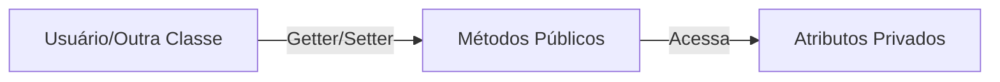

# Aula 03 - Encapsulamento e Construtores 🔒

Nesta aula, vamos aprender como proteger nossos dados e como inicializar nossos objetos de forma correta.

## 😊 Encapsulamento

Encapsulamento é a técnica de esconder os detalhes internos de uma classe e fornecer uma interface segura para interagir com ela. É como um controle remoto: você sabe quais botões apertar, mas não precisa saber como o circuito interno funciona.

### Modificadores de Acesso
*   `public`: Acesso total.
*   `private`: Acesso restrito à própria classe.
*   `protected`: Acesso às subclasses.

### Getters e Setters
São métodos utilizados para ler (`get`) e modificar (`set`) atributos privados.

## 📊 Estrutura de Encapsulamento



## 🧠 Construtores

Um **Construtor** é um método especial chamado no momento da criação do objeto. Ele serve para garantir que o objeto comece com valores válidos.

> [!CAUTION]
> Se você não definir nenhum construtor, o Java criará um padrão (vazio). Mas se você criar um, o padrão deixará de existir.

```java
public class Cliente {
    private String nome;

    // Construtor
    public Cliente(String nome) {
        this.nome = nome;
    }
}
```

## 💻 Exemplo no Terminal

<!-- termynal -->
```bash
$ # Compilando classes com modificadores
$ javac -d . Cliente.java
$ java Main
Erro: Atributo 'nome' é privado! Use getNome().
```

## 📝 Exercícios Progressivos

1.  **Básico:** Para que serve o modificador `private`?
2.  **Básico:** Qual a função de um método "Setter"?
3.  **Intermediário:** Por que não devemos deixar todos os atributos como `public`?
4.  **Intermediário:** O que é a palavra-chave `this` dentro de um construtor?
5.  **Desafio:** Crie uma classe `Funcionario` com atributo `salario` privado. Crie um setter que só aceite valores positivos.

🚀 **Mini-projeto:** Implemente a classe `ContaBancaria` com encapsulamento total e um construtor que peça o nome do titular e o saldo inicial.
