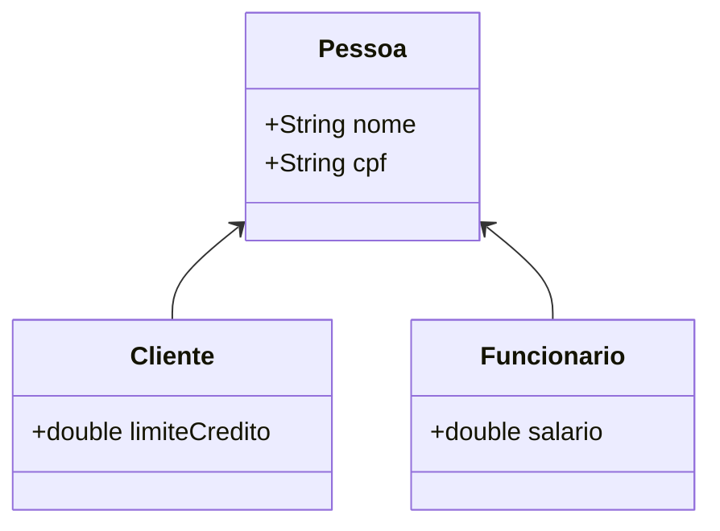

# Aula 04 - Herança e Polimorfismo 🧬

Hoje exploraremos dois pilares poderosos da POO que permitem o reuso de código e a flexibilidade do sistema.

## 😊 Herança

A herança permite que uma classe (Filha ou Subclasse) herde atributos e métodos de outra classe (Pai ou Superclasse).

**Vantagem:** Evita repetição de código (DRY - Don't Repeat Yourself).

### Exemplo de Hierarquia:
*   **Pessoa** (Pai)
    *   **Cliente** (Filho)
    *   **Funcionário** (Filho)

## 📊 Diagrama de Herança



## 🧠 Polimorfismo

Polimorfismo significa "muitas formas". É a capacidade de um objeto ser tratado como sua superclasse, mas se comportar de acordo com sua classe real.

> [!IMPORTANT]
> A **Sobre-escrita (@Override)** é essencial para o polimorfismo, permitindo que o filho personalize um comportamento herdado do pai.

```java
Pessoa p = new Funcionario(); // Polimorfismo
p.exibirDados(); // Chama a versão do Funcionário
```

## 📝 Exercícios Progressivos

1.  **Básico:** Na frase "Todo Carro é um Veículo", quem é a Superclasse?
2.  **Básico:** O que significa a anotação `@Override`?
3.  **Intermediário:** Explique a diferença entre Herança e Composição (brevíssimo).
4.  **Intermediário:** Crie uma hierarquia entre `Animal`, `Cachorro` e `Gato`. Qual método seria sobre-escrito?
5.  **Desafio:** No sistema de um banco, por que é útil tratar `ContaCorrente` e `ContaPoupanca` apenas como `Conta` em um loop de processamento?

🚀 **Mini-projeto:** Crie uma classe `Pessoa` e duas subclasses. Implemente um método `apresentar()` na classe pai e mude o comportamento nas classes filhas usando `@Override`.
