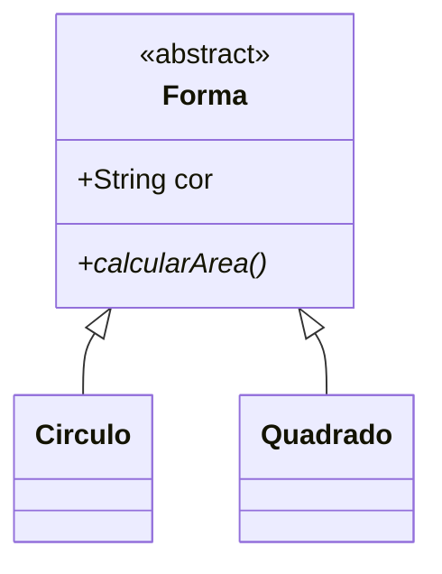

# Aula 05 - Classes Abstratas e Interfaces 🧩

Hoje vamos aprender como definir contratos e modelos incompletos para garantir a fluidez da nossa arquitetura.

## 😊 Classes Abstratas

Uma **Classe Abstrata** é uma classe que não pode ser instanciada diretamente. Ela serve apenas como um "rascunho" ou base para outras classes.

*   Pode conter métodos com corpo (comuns).
*   Pode conter métodos sem corpo (abstratos), que **obrigam** os filhos a implementarem.

## 📊 Exemplo: Forma Geométrica



## 🧠 Interfaces

Uma **Interface** é um "contrato". Ela define **o que** uma classe deve fazer, mas não **como** fazer.

> [!TIP]
> Use Interfaces quando quiser definir um comportamento comum a classes que não pertencem necessariamente à mesma hierarquia (ex: `Autenticavel`).

```java
public interface Autenticavel {
    boolean login(String senha);
}
```

## 🧠 Glossário Rápido

> [!NOTE]
> **Extends:** Usado para herança (Classes).
> **Implements:** Usado para contratos (Interfaces).

## 📝 Exercícios Progressivos

1.  **Básico:** Posso criar um objeto de uma classe abstrata (`new ClasseAbstrata()`)?
2.  **Básico:** Quantas interfaces uma classe Java pode implementar?
3.  **Intermediário:** Qual a principal diferença entre uma Classe Abstrata e uma Interface?
4.  **Intermediário:** Se eu tenho a interface `Voador` com o método `voar()`, o que acontece se eu esquecer de implementar esse método na classe `Passaro`?
5.  **Desafio:** Crie um diagrama Mermaid para um sistema de pagamentos (`Pagamento` abstrato, `Cartao` e `Boleto` como filhos).

🚀 **Mini-projeto:** Crie a classe abstrata `Funcionario` com o método abstrato `calcularBonus()`. Implemente as classes `Gerente` e `Operador` com cálculos diferentes.
