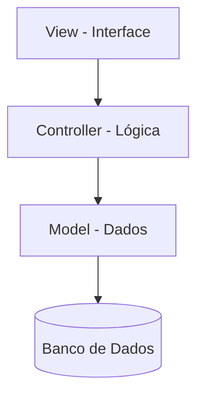

# Aula 06 - Organização de Projetos 📂

À medida que o software cresce, a organização se torna fundamental. Hoje vamos aprender como estruturar pastas e pacotes.

## 😊 Pacotes (Packages)

Pacotes são como pastas que organizam classes relacionadas. Eles evitam conflitos de nomes e facilitam a manutenção.

**Convenção:** `com.empresa.projeto.modulo`

## 📊 Estrutura de Camadas

Um sistema bem projetado deve ser separado em responsabilidades:



### Por que separar em camadas?
1.  **Manutenibilidade:** Fácil de encontrar erros.
2.  **Reuso:** Posso trocar a interface sem mexer no banco.
3.  **Trabalho em Equipe:** Várias pessoas podem mexer em partes diferentes ao mesmo tempo.

## 🧠 Introdução ao Padrão MVC

*   **Model:** Representa os dados e regras de negócio.
*   **View:** O que o usuário vê (telas).
*   **Controller:** O intermediário que recebe comandos da View e atualiza o Model.

## 💻 Estrutura de Pastas Sugerida

<!-- termynal -->
```bash
$ tree
.
├── src
│   ├── model       # Classes de dados
│   ├── view        # Telas (Swing/JavaFX)
│   ├── controller  # Lógica de controle
│   └── util        # Funções auxiliares
```

## 📝 Exercícios Progressivos

1.  **Básico:** Por que usamos pacotes em Java?
2.  **Básico:** Qual a função da camada `Model` no MVC?
3.  **Intermediário:** O que acontece se misturarmos código de banco de dados dentro de um botão da tela?
4.  **Intermediário:** Cite uma vantagem da separação de responsabilidades.
5.  **Desafio:** Organize as classes `Cliente`, `ClienteController` e `TelaCliente` em uma estrutura de pastas lógica.

🚀 **Mini-projeto:** Crie um novo projeto no seu IDE e estruture os pacotes `model`, `view` e `controller`. Mova as classes criadas nas aulas anteriores para os pacotes corretos.
