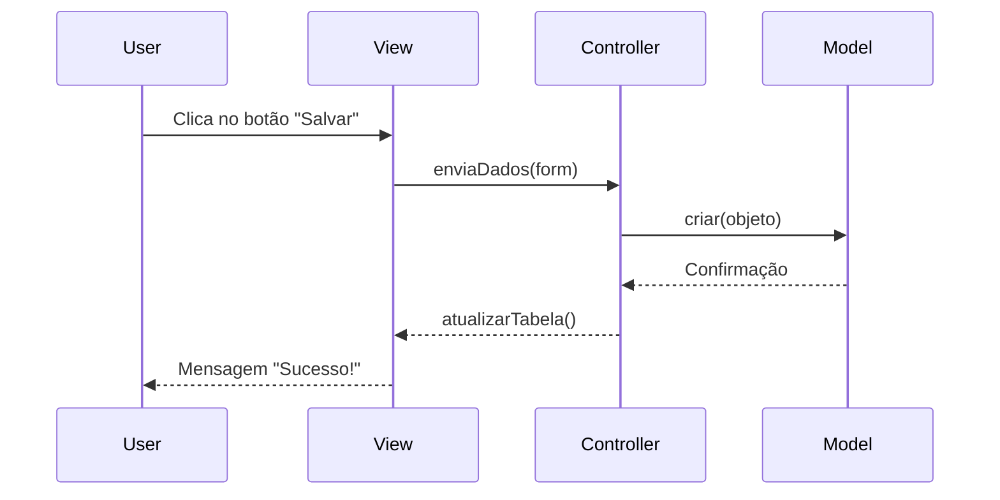

# Aula 07 - Padrão MVC na Prática 🏗️

Nesta aula, vamos aprender a separar as responsabilidades do nosso sistema de forma profissional utilizando o padrão **MVC (Model-View-Controller)**.

## 😊 O que é MVC?

O MVC é um padrão de arquitetura que divide a aplicação em três componentes principais:

1.  **Model (Modelo):** Onde os dados vivem. Não conhece a interface nem o banco diretamente.
2.  **View (Visão):** A cara do sistema. Botões, campos de texto e janelas.
3.  **Controller (Controle):** O cérebro. Escuta os eventos da View e manda o Model agir.

## 📊 Fluxo de Dados no MVC



## 🧠 Separação de Responsabilidades

> [!IMPORTANT]
> A regra de ouro é: **A View nunca deve conter lógica de negócio (cálculos, validações complexas, acesso a dados).** Ela deve apenas repassar o que o usuário quer para o Controller.

## 💻 Refatoração para MVC

Imagine que tínhamos tudo em um único arquivo. Agora separamos:

<!-- termynal -->
```bash
$ # Antes: Tudo em App.java
$ # Depois:
$ ls src/
controller/  # ProdutoController.java
model/       # Produto.java
view/        # Principal.java (JFrame)
```

## 📝 Exercícios Progressivos

1.  **Básico:** Relacione as siglas: M - ______, V - ______, C - ______.
2.  **Básico:** Por que o Controller é chamado de "intermediário"?
3.  **Intermediário:** Se eu quiser mudar a cor de um botão, em qual camada devo mexer?
4.  **Intermediário:** Se eu mudar a fórmula de cálculo de imposto de um produto, em qual camada devo mexer?
5.  **Desafio:** Descreva o que acontece no MVC quando um usuário solicita a exclusão de um registro em uma tabela.

🚀 **Mini-projeto:** Refatore o mini-projeto da aula anterior (Produto) para que ele utilize o padrão MVC. O Controller deve ser responsável por imprimir os detalhes no console após a ação da "View" (que por enquanto será um método main).
