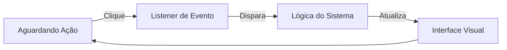

# Aula 08 - Introdução à Interface Gráfica (GUI) 🎨

Chegou a hora de dar "cara" aos nossos sistemas! Vamos sair do terminal e entrar nas janelas.

## 😊 O que é GUI?

GUI (*Graphical User Interface*) permite que os usuários interajam com o software através de elementos visuais como ícones, botões e janelas, em vez de apenas texto.

### Componentes de uma Janela
*   **JFrame:** A moldura (janela principal).
*   **JPanel:** Uma área dentro da janela para organizar itens.
*   **JButton:** Botões de ação.
*   **Layouts:** Regras que definem onde cada coisa fica.

## 📊 Ciclo de Eventos

Diferente do terminal (sequencial), uma GUI é baseada em **Eventos**.



## 🧠 Tratamento de Eventos (Listeners)

> [!NOTE]
> Um **ActionListener** é um objeto que "fica ouvindo" se um clique aconteceu em um botão. Quando o clique ocorre, ele executa um código específico.

## 💻 Minha Primeira Janela

```java
JFrame janela = new JFrame("Meu Sistema");
janela.setSize(400, 300);
janela.setDefaultCloseOperation(JFrame.EXIT_ON_CLOSE);
janela.setVisible(true);
```

## 🧠 Dica de Design

> [!TIP]
> Use nomes claros para seus botões e componentes. Em vez de `jButton1`, use `btnSalvar` ou `btnSair`. Isso facilita muito a leitura do código no futuro.

## 📝 Exercícios Progressivos

1.  **Básico:** O que significa a sigla GUI?
2.  **Básico:** Qual a função do `JFrame`?
3.  **Intermediário:** Para que serve o método `setDefaultCloseOperation`? O que acontece se não usarmos?
4.  **Intermediário:** Explique o conceito de "Event-Driven Programming" (Programação Orientada a Eventos).
5.  **Desafio:** Desenhe (ou use Mermaid) a estrutura de uma janela que contenha 3 botões (Incluir, Alterar, Excluir).

🚀 **Mini-projeto:** Crie uma janela simples em Java que, ao ser clicada em um botão, exiba uma mensagem de "Olá!" usando `JOptionPane`.
