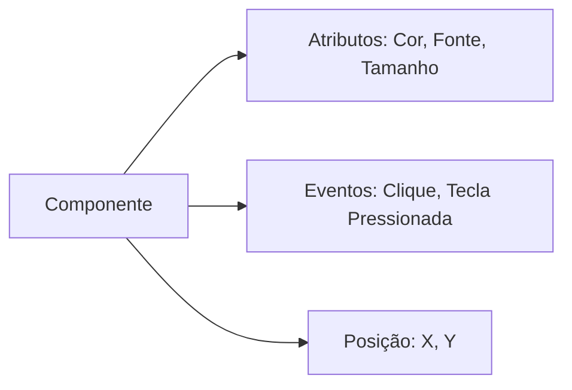

# Aula 09 - Componentes Básicos 🏗️

Nesta aula, vamos conhecer os "tijolos" fundamentais para construir qualquer formulário desktop.

## 😊 Componentes de Texto e Ação

*   **JLabel:** Usado para exibir textos informativos ou instruções (ex: "Nome:", "Senha:").
*   **JTextField:** Campo de uma única linha para o usuário digitar informações.
*   **JButton:** O botão clássico para disparar ações.
*   **JOptionPane:** Caixas de diálogo prontas para avisos ou perguntas rápidas.

## 📊 Estrutura de um Componente



## 🧠 Tratamento de Eventos (Prática)

> [!IMPORTANT]
> Para capturar o texto digitado em um `JTextField`, usamos o método `.getText()`. Para limpar o campo, usamos `.setText("")`.

```java
String nome = txtNome.getText();
if(nome.isEmpty()) {
    JOptionPane.showMessageDialog(null, "Digite seu nome!");
}
```

## 🧠 Dica de UX

> [!TIP]
> **Feedback Visual:** Sempre que uma ação for concluída (ou falhar), avise o usuário. Um `JOptionPane` é a forma mais simples de fazer isso.

## 📝 Exercícios Progressivos

1.  **Básico:** Qual a diferença entre um `JLabel` e um `JTextField`?
2.  **Básico:** Como exibimos uma mensagem de erro na tela?
3.  **Intermediário:** Qual método é usado para pegar o texto de um campo de entrada?
4.  **Intermediário:** Por que devemos validar se um campo está vazio antes de processar os dados?
5.  **Desafio:** Escreva o código (ou lógica) para um botão que pegue dois números de dois `JTextField`, some-os e exiba o resultado em um `JOptionPane`.

🚀 **Mini-projeto:** Crie um formulário de login simples com: Dois `JLabel`, um `JTextField` (usuário), um `JPasswordField` (senha) e um `JButton`. Ao clicar, verifique se usuário e senha são iguais a "admin".
