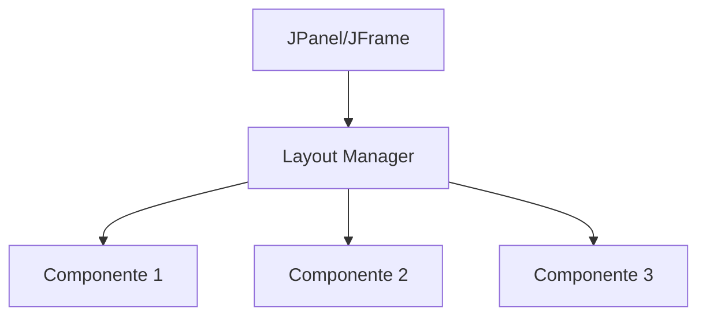

# Aula 10 - Componentes Intermediários 🎛️

Hoje vamos aprender a usar componentes de seleção e como organizar tudo isso de forma bonita usando **Layouts**.

## 😊 Componentes de Seleção

*   **JCheckBox:** Permite selecionar múltiplas opções (ex: Interesses, Habilidades).
*   **JRadioButton:** Permite selecionar apenas **uma** opção de um grupo (ex: Sexo, Estado Civil).
    *   *Nota:* Precisam de um `ButtonGroup` para funcionar corretamente.
*   **JComboBox:** Uma lista suspensa (dropdown) para economizar espaço em tela.

## 📊 Organização com Layouts

Colocar componentes em posições fixas (X, Y) é perigoso porque a janela pode ser redimensionada. Por isso usamos **Layout Managers**:

| Layout | Descrição |
| :--- | :--- |
| **FlowLayout** | Itens em linha, um após o outro. |
| **BorderLayout** | Divide em Norte, Sul, Leste, Oeste e Centro. |
| **GridLayout** | Divide em uma grade de linhas e colunas iguais. |

## 🧠 Dica de Organização

> [!NOTE]
> Use **JPanels** como sub-containers. Você pode ter um painel com `GridLayout` para o formulário e outro painel com `FlowLayout` apenas para os botões na parte de baixo.

## 📝 Exercícios Progressivos

1.  **Básico:** Qual componente usar para "Termos de Aceite" (onde o usuário marca se concorda)?
2.  **Básico:** Qual a diferença entre `JCheckBox` e `JRadioButton`?
3.  **Intermediário:** Qual `Layout Manager` você usaria para criar uma calculadora (teclado numérico)?
4.  **Intermediário:** O que acontece se você não adicionar `JRadioButtons` a um `ButtonGroup`?
5.  **Desafio:** Desenhe a estrutura (usando blocos) de uma tela de cadastro que use `BorderLayout` para separar o Título (Norte), Campos (Centro) e Botões (Sul).

🚀 **Mini-projeto:** Crie uma tela de "Escolha seu Plano" com 3 `JRadioButton` (Prata, Ouro, VIP) e um `JComboBox` com as cidades de atendimento. Exiba a escolha do usuário ao clicar em um botão.
