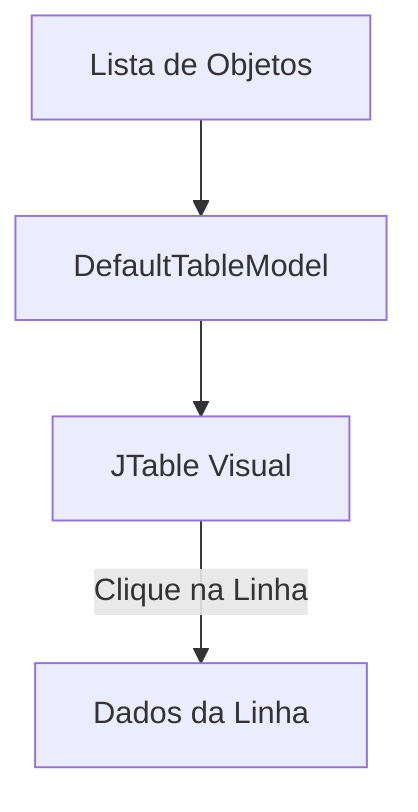

# Aula 11 - Interfaces Avançadas 📑

Hoje vamos aprender a organizar grandes volumes de informação usando abas, menus e tabelas profissionais.

## 😊 Componentes de Organização

*   **JTabbedPane:** Cria abas, permitindo separar diferentes formulários ou relatórios em uma mesma janela.
*   **JMenuBar / JMenu / JMenuItem:** Cria a barra de menus no topo da janela (Arquivos, Editar, Ajuda).
*   **JTable:** O componente mais importante para sistemas de gestão. Exibe dados em formato de planilha.

## 📊 Estrutura de uma JTable

A `JTable` funciona através de um **Model** (normalmente `DefaultTableModel`).



## 🧠 Validação e UX (User Experience)

> [!IMPORTANT]
> **Validação de Formulários:** Antes de adicionar dados à tabela ou ao banco, verifique se os tipos estão corretos (ex: se o preço é realmente um número).

```java
try {
    double preco = Double.parseDouble(txtPreco.getText());
} catch (NumberFormatException e) {
    JOptionPane.showMessageDialog(null, "Preço inválido!");
}
```

## 🧠 Dica de Carreira

> [!TIP]
> Sistemas desktop modernos dão muita importância às tabelas. Aprender a filtrar, ordenar e colorir linhas de uma `JTable` é um diferencial enorme.

## 📝 Exercícios Progressivos

1.  **Básico:** Quando devemos usar abas (`JTabbedPane`) em um sistema?
2.  **Básico:** Qual a diferença entre `JMenu` e `JMenuItem`?
3.  **Intermediário:** Por que usamos um `TableModel` em vez de colocar os dados direto na `JTable`?
4.  **Intermediário:** Como podemos impedir que o usuário digite letras em um campo de "Idade"?
5.  **Desafio:** Desenhe (ou descreva) o menu principal de um "Sistema de Biblioteca", contendo as opções de Cadastro, Movimentação e Relatórios.

🚀 **Mini-projeto:** Crie uma tela com duas abas: "Cadastro" (com campos de texto) e "Listagem" (com uma `JTable`). Ao clicar em salvar na primeira aba, os dados devem aparecer na tabela da segunda aba.
