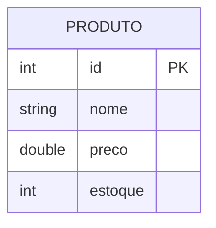

# Aula 12 - Introdução a Banco de Dados 🗄️

Nesta aula, iniciamos nossa jornada na persistência de dados. O que acontece com os dados quando fechamos o programa?

## 😊 Banco de Dados Relacional

Um banco de dados relacional (como MySQL, SQL Server ou SQLite) organiza os dados em tabelas que se relacionam entre si.

### Conceitos Básicos:
*   **Tabela:** Conjunto de registros de um mesmo tipo (ex: Cliente).
*   **Registro (Linha):** Uma instância de dado (ex: João Santos).
*   **Coluna (Campo):** Uma característica (ex: Nome, CPF).
*   **Chave Primária (PK):** O identificador único de um registro.

## 📊 Modelagem Simples



## 🧠 Linguagem SQL

Para conversar com o banco, usamos o **SQL** (*Structured Query Language*).

> [!NOTE]
> **CREATE TABLE:** Cria a estrutura.
> **INSERT:** Adiciona dados.
> **SELECT:** Recupera dados.

## 💻 Comandos Básicos

<!-- termynal -->
```bash
$ # Criando uma tabela
$ sqlite3 sistema.db
sqlite> CREATE TABLE produto (id INTEGER PRIMARY KEY, nome TEXT, preco REAL);
sqlite> INSERT INTO produto (nome, preco) VALUES ('Mouse', 50.0);
sqlite> SELECT * FROM produto;
1|Mouse|50.0
```

## 📝 Exercícios Progressivos

1.  **Básico:** O que significa a sigla SQL?
2.  **Básico:** Para que serve a "Chave Primária" (Primary Key)?
3.  **Intermediário:** Qual a diferença entre um Banco de Dados e uma Planilha de Excel?
4.  **Intermediário:** Escreva o comando SQL para inserir um cliente chamado "Maria" com o CPF "123.456.789-00".
5.  **Desafio:** Modele uma tabela `Funcionario` com pelo menos 5 colunas e defina os tipos de dados ideais para cada uma.

🚀 **Mini-projeto:** Instale o SQLite Browser (ou use o terminal) e crie sua primeira tabela de `Produtos` com 3 registros iniciais.
