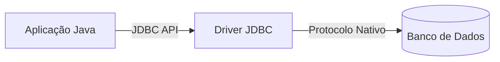

# Aula 13 - Conexão com Banco de Dados 🔌

Nesta aula, aprenderemos como fazer o Java "conversar" com o Banco de Dados através do Driver JDBC.

## 😊 O que é JDBC?

**JDBC** (*Java Database Connectivity*) é um conjunto de classes e interfaces que permite que aplicações Java se conectem a diversos bancos de dados (MySQL, SQLite, PostgreSQL, etc) usando uma linguagem comum.

### O Papel do Driver
O Driver é como um tradutor. Cada banco de dados tem o seu próprio driver.

## 📊 Estrutura de Conexão



## 🧠 Testando a Conexão

Para conectar, precisamos de uma **URL de Conexão**. No caso do SQLite, ela aponta para um arquivo local.

> [!IMPORTANT]
> Sempre feche a conexão (`connection.close()`) quando terminar de usá-la para não desperdiçar memória do sistema.

```java
String url = "jdbc:sqlite:meubanco.db";
try (Connection conn = DriverManager.getConnection(url)) {
    if (conn != null) {
        System.out.println("Conectado com sucesso!");
    }
} catch (SQLException e) {
    System.out.println("Erro ao conectar: " + e.getMessage());
}
```

## 🧠 Dica de Segurança

> [!CAUTION]
> Nunca deixe a senha do seu banco de dados escrita diretamente no código fonte (Hardcoded). Use arquivos de configuração ou variáveis de ambiente.

## 📝 Exercícios Progressivos

1.  **Básico:** Para que serve o JDBC?
2.  **Básico:** O que acontece se tentarmos conectar ao banco sem o "Driver" instalado?
3.  **Intermediário:** Por que usamos o bloco `try-catch` ao realizar uma conexão?
4.  **Intermediário:** Qual a diferença entre uma conexão com SQLite (local) e MySQL (servidor) em termos de URL?
5.  **Desafio:** Desenhe um diagrama de sequência mostrando a aplicação pedindo uma conexão ao `DriverManager`.

🚀 **Mini-projeto:** Crie uma classe `ConexaoBanco` com um método estático que retorne uma `Connection` ativa para o seu banco SQLite.
