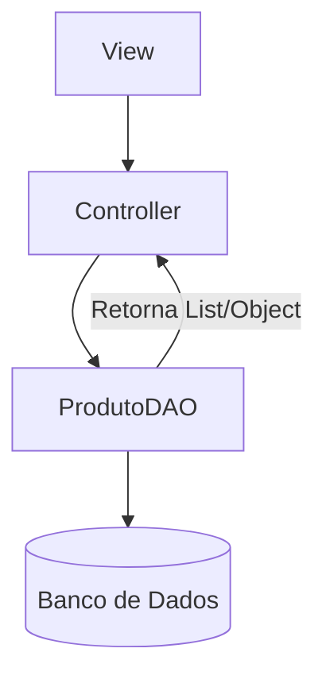

# Aula 14 - CRUD e DAO 💾

Hoje aprenderemos o padrão mais utilizado no mercado para persistência de dados: o **DAO**.

## 😊 O que é DAO?

**DAO** (*Data Access Object*) é um padrão de projeto que isola todo o código de acesso ao banco de dados em classes específicas. Isso mantém o restante do sistema (Controller e Model) limpo e focado em suas próprias tarefas.

### O que é CRUD?
É o acrônimo para as quatro operações básicas em um banco de dados:
*   **C**reate (**INSERT**)
*   **R**ead (**SELECT**)
*   **U**pdate (**UPDATE**)
*   **D**elete (**DELETE**)

## 📊 Camada DAO no Sistema



## 🧠 Exemplo de DAO (Insert)

> [!IMPORTANT]
> Ao usar o DAO, o Controller não sabe qual SQL está sendo executado. Ele apenas pede: `dao.salvar(produto)`.

```java
public void salvar(Produto p) {
    String sql = "INSERT INTO produto (nome, preco) VALUES (?, ?)";
    // Código para executar...
}
```

## 📝 Exercícios Progressivos

1.  **Básico:** O que significa a sigla CRUD?
2.  **Básico:** Qual a principal vantagem do padrão DAO?
3.  **Intermediário:** Por que passamos um objeto (ex: `Produto`) para o método do DAO em vez de passar os atributos soltos?
4.  **Intermediário:** Em qual camada do MVC o DAO deve ser chamado?
5.  **Desafio:** Descreva as 4 assinaturas de métodos (nome e parâmetros) que uma classe `ClienteDAO` deveria ter para um CRUD completo.

🚀 **Mini-projeto:** Crie a classe `ProdutoDAO` e implemente o método `salvar`. Teste inserindo um produto através do seu código Java e verifique no banco de dados.
