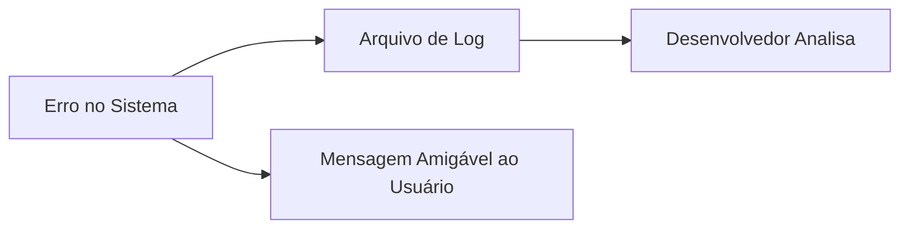

# Aula 15 - Segurança e Boas Práticas 🛡️

Na penúltima aula, vamos aprender como proteger nosso sistema contra ataques e como escrever um código profissional e limpo.

## 😊 Prevenção contra SQL Injection

O **SQL Injection** é um dos ataques mais comuns, onde um usuário mal-intencionado tenta "injetar" comandos SQL através de campos de formulário.

> [!IMPORTANT]
> **A SOLUÇÃO:** Nunca concatene strings para montar seu SQL. Use sempre o **PreparedStatement**.

```java
// ERRADO (Vulnerável)
String sql = "SELECT * FROM usuario WHERE login = '" + login + "'";

// CORRETO (Seguro)
String sql = "SELECT * FROM usuario WHERE login = ?";
PreparedStatement ps = conn.prepareStatement(sql);
ps.setString(1, login);
```

## 📊 Tratamento de Exceções Profissional

Não basta apenas imprimir o erro. Devemos registrar o que aconteceu para poder consertar depois.



## 🧠 Boas Práticas (Refatoração)

> [!TIP]
> **DRY (Don't Repeat Yourself):** Se você está repetindo o mesmo código de conexão em todas as telas, crie uma classe `ConexaoBanco` e reutilize-a.

## 💻 Depuração (Debug)

Aprender a usar o **Debug** da IDE (colocar Breakpoints) economiza horas de trabalho. Em vez de adivinhar o que está errado, você vê o valor das variáveis em tempo real.

## 📝 Exercícios Progressivos

1.  **Básico:** O que é SQL Injection?
2.  **Básico:** Por que não devemos mostrar a "Exception" técnica completa para o usuário final?
3.  **Intermediário:** Qual a função do `PreparedStatement` na segurança?
4.  **Intermediário:** O que são "Logs" e por que são importantes em sistemas desktop?
5.  **Desafio:** Escreva um pequeno trecho de código que trate uma `SQLException` e exiba uma mensagem amigável: "Houve um problema ao conectar com o servidor. Tente novamente mais tarde."

🚀 **Mini-projeto:** Refatore seu `ProdutoDAO` para que todos os métodos utilizem `PreparedStatement` e tenham tratamento de erro com `try-catch`.
