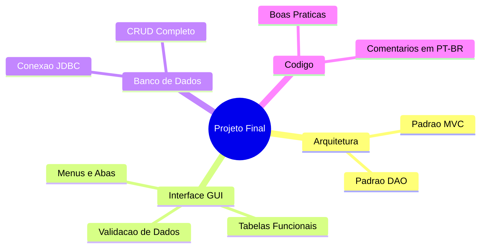

# Aula 16 - Projeto Integrador 🚀

Parabéns por chegar até aqui! Agora é hora de colocar todo o conhecimento em prática construindo um sistema completo.

## 😊 O Desafio Final

Você deve desenvolver um sistema desktop funcional seguindo todos os padrões aprendidos: **POO + MVC + GUI + Banco de Dados (DAO)**.

### Sugestões de Temas:
1.  **Controle de Vendas:** Cadastro de produtos e registro de vendas simples.
2.  **Biblioteca Pessoal:** Cadastro de livros e controle de empréstimos.
3.  **Controle de Tarefas (To-do):** Lista de tarefas com prioridade e status.
4.  **Gestão de Pets:** Cadastro de animais de estimação e histórico de consultas.

## 📊 Requisitos do Projeto

O projeto será avaliado seguindo estes critérios:

## 🧠 Checklist de Entrega

*   [ ] Banco de Dados criado (arquivo `.db`).
*   [ ] Telas de Cadastro e Listagem funcionando.
*   [ ] Operações de Alterar e Excluir implementadas.
*   [ ] Código organizado em pacotes (`model`, `view`, `controller`, `dao`).
*   [ ] Sem erros de execução (Exceptions tratadas).

## 📝 Documentação Exigida

> [!NOTE]
> Escreva um pequeno arquivo `README.md` para o seu projeto explicando:
> 1. O que o sistema faz.
> 2. Como executá-lo.
> 3. Quais tecnologias utilizou.

🚀 **Mini-projeto:** Inicie o desenvolvimento do seu sistema. Comece pela modelagem do banco de dados e pela criação das classes de modelo Java.

---
**Boa sorte e bom trabalho! Você está pronto para o mercado desktop!** 🖥️🎓
