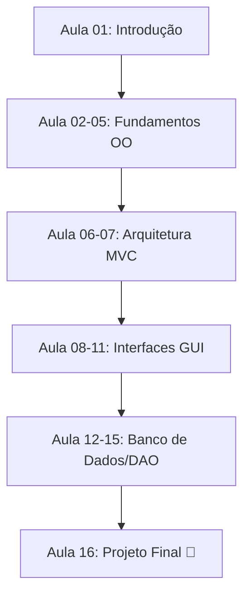

# Roadmap do Projeto 🗺️

Este documento descreve a evolução do aprendizado ao longo das 16 aulas.

## 📈 Marcos do Aprendizado

1. **Marco 1: Pensamento OO (Aulas 01-05)**
   ---
   Capacidade de abstrair problemas reais em classes e objetos.

2. **Marco 2: Organização Profissional (Aulas 06-07)**
   ---
   Aplicação de padrões de mercado para estruturação de software.

3. **Marco 3: Domínio da Interface (Aulas 08-11)**
   ---
   Criação de janelas e componentes que interagem com o usuário.

4. **Marco 4: Persistência Robusta (Aulas 12-15)**
   ---
   Integração segura com bancos de dados relacionais.

5. **Marco Final: O Desenvolvedor Desktop (Aula 16)**
   ---
   Entrega de um sistema completo e funcional.