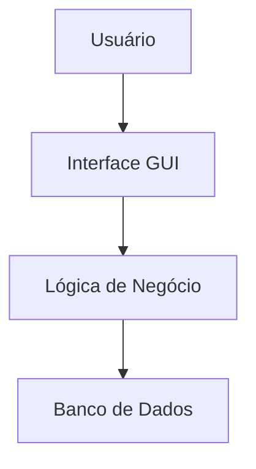

# Introdução ao Desenvolvimento Desktop 🖥️

---

## O que vamos aprender?

* O que é software desktop 🤔
* Diferença entre Web e Desktop 🌐 vs 💻
* Estrutura de um projeto corporativo 🏗️
* Ambiente de desenvolvimento (JDK + IDE) 🛠️

---

## O que é Software Desktop?

São aplicações instaladas diretamente no SO (Windows, Mac, Linux).

* **Vantagens:** Acesso total ao hardware, arquivos locais e performance 🚀.
* **Exemplos:** Photoshop, Office, PDVs de mercado.

---

## Estrutura do Projeto

---

## Por que Desktop ainda é relevante?

* Funciona sem internet (offline) 📶
* Menor latência (resposta instantânea) ⚡
* Integração com periféricos (impressoras, scanners) 🖨️

---

## Ambiente Java

Precisamos do **JDK** (Java Development Kit) para desenvolver.

O **JRE** serve apenas para rodar o software pronto.

---

## Ciclo de Vida Java

1. Código Fonte (`.java`)
2. Compilação (`javac`)
3. Bytecode (`.class`)
4. Execução (`java`) na **JVM**

---

## IDE: Nossa Oficina

Utilizaremos ferramentas profissionais como **IntelliJ IDEA**, **Eclipse** ou **VS Code**.

Facilitam:
* Auto-complete
* Debug
* Gestão de arquivos

---

## Primeiro Desafio! 🏁

Vamos configurar o Java e rodar o famoso **Hello World**.

---

## Resumo da Aula

* Desktop = Local
* Orientado a Objetos = Padrão de Mercado
* Ambiente Seguro e Robusto

---

## Próxima Aula: Classes e Objetos! 🚀
