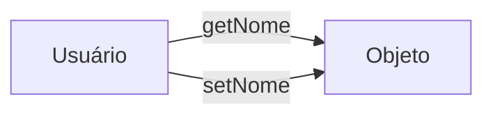

# Encapsulamento e Construtores 🔒

Protegendo seus dados

---

## O que é Encapsulamento?

É a técnica de esconder os detalhes internos e proteger o estado do objeto.

Pense em um **comprimido**: a cápsula protege o remédio.

---

## Modificadores de Acesso 🛠️

* **`public`**: Todos veem.
* **`private`**: Apenas a própria classe vê.
* **`protected`**: Apenas a classe e seus "filhos" veem.

---

## Getters e Setters

Mecanismos de controle.



---

## Por que usar Setters? 🛡️

Para **validar** dados!

```java
public void setIdade(int idade) {
    if (idade > 0) {
        this.idade = idade;
    }
}
```

---

## Construtores

O método que "roda" no `new`.

Garante que o objeto nasça com os dados essenciais.

---

## O uso do `this`

Resolve o conflito entre o nome do atributo e o nome do parâmetro.

```java
public Cliente(String nome) {
    this.nome = nome;
}
```

---

## Sobrecarga (Overloading)

Ter dois ou mais construtores com parâmetros diferentes.

* `new Cliente()`
* `new Cliente("João")`

---

## Resumo da Aula

* Atributos = Quase sempre `private`
* Métodos = Quase sempre `public`
* Construtor = Inicialização segura

---

## Próximo Passo: Herança e Polimorfismo! 🧬
