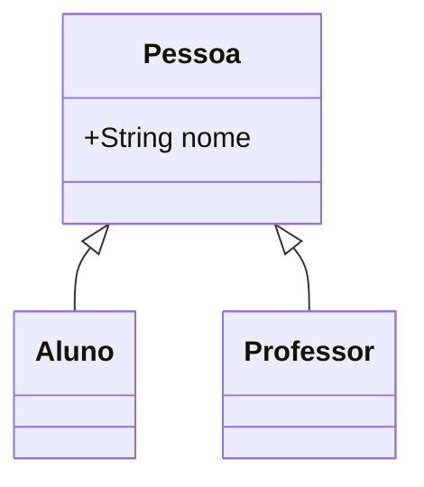

# Herança e Polimorfismo 🧬

Reuso e Flexibilidade

---

## Herança: O Reuso

Permite que uma classe herde tudo o que outra já tem.

Classe Pai (Superclasse) ➔ Classe Filho (Subclasse)

---

## Exemplo Prático



---

## Palavra-chave: `extends`

Define quem é o pai.

```java
public class Aluno extends Pessoa {
    private String matricula;
}
```

---

## Polimorfismo

"Muitas formas".

Um objeto pode ser referido pelo tipo do pai, mas se comporta como o filho.

---

## Sobre-escrita (`@Override`)

Mudar o comportamento de um método herdado.

```java
@Override
public void falar() {
    System.out.println("Olá, eu sou um Aluno!");
}
```

---

## O Uso do `super`

Acessa membros da superclasse diretamente.

---

## Vantagens 🚀

* Menos código repetido.
* Sistema fácil de expandir.
* Código mais genérico e flexível.

---

## Resumo da Aula

* Herança = "É um" 
* Polimorfismo = Flexibilidade
* `@Override` = Especialização

---

## Próximo Passo: Abstração e Interfaces! 🧩
