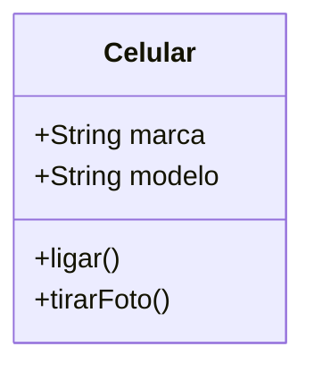

# Classes e Objetos 🧱

O coração da POO

---

## O que é uma Classe?

É um **modelo** ou **molde**.

Define:
* O que o objeto **tem** (Atributos)
* O que o objeto **faz** (Métodos)

---

## O que é um Objeto?

É a **instância** real do modelo.

Exemplo:
* Classe: `Carro`
* Objeto: `Meu Fusca Azul`

---

## Modelagem no Mermaid



---

## Atributos vs Métodos

* **Atributos:** Dados/Estado (cor, nome, preco).
* **Métodos:** Comportamento/Ação (salvar(), calcular()).

---

## Instanciação: O Nascimento

Usamos a palavra-chave **`new`**.

```java
Celular c1 = new Celular();
c1.marca = "Apple";
c1.ligar();
```

---

## Memória Heap 🧠

Quando fazemos `new`, o Java reserva um espaço na memória para aquele objeto específico.

Independentemente de outros objetos da mesma classe.

---

## Atributo de Instância

Cada objeto tem sua própria cópia dos atributos.

Alterar o preço do `Produto A` não afeta o `Produto B`.

---

## Convenção Java 📌

* **Classes:** Inciam com Maiúscula (`Produto`).
* **Objetos/Variáveis:** Letra minúscula (`meuProduto`).
* **Padrão:** camelCase.

---

## Resumo da Aula

* Classe = Molde
* Objeto = Realidade
* `new` = Criar

---

## Próximo Passo: Encapsulamento! 🔒
