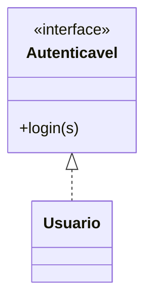

# Abstração e Interfaces 🧩

Desenhando Contratos

---

## Classes Abstratas

Incompletas por natureza. Não podem ser instanciadas.

Servem apenas como molde base.

---

## Métodos Abstratos

Assinaturas sem corpo. **Obrigam** o filho a implementar.

```java
public abstract void calcularArea();
```

---

## Interfaces: O Contrato

Define **o que** uma classe deve fazer.

```java
public interface Autenticavel {
    boolean login(String s);
}
```

---

## Mermaid: Interfaces



---

## Qual a diferença? 🤔

* **Classe Abstrata:** Pode ter código pronto. Representa "O que eu SOU".
* **Interface:** Apenas assinaturas. Representa "O que eu FAÇO".

---

## Múltiplas Interfaces

Uma classe pode implementar várias interfaces ao mesmo tempo, mas herdar de apenas uma classe.

---

## Resumo da Aula

* Abstrata = Rascunho
* Interface = Contrato
* `implements` = Cumprir a promessa

---

## Próximo Passo: Organização de Projetos! 📂
