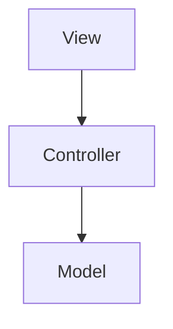

# Organização de Projetos 📂

Software Profissional

---

## O Problema do Caos 🤯

Muitas classes em uma mesma pasta dificultam a manutenção.

A solução? **Pacotes (Packages)**.

---

## Padrão de Nomenclatura

Domínio invertido:
`br.com.empresa.projeto.modulo`

Evita conflitos globais de nomes.

---

## Camadas (N-Tier)

Dividir o sistema por responsabilidades.



---

## Benefícios da Separação

* **Manutenibilidade:** Erros fáceis de achar.
* **Testabilidade:** Cada parte pode ser testada sozinha.
* **Reuso:** O Model serve para Desktop e Web.

---

## Pacotes Essenciais

* `model`: Dados e Entidades.
* `view`: Telas (Swing/Janelas).
* `controller`: Lógica e fluxo.

---

## O comando `import`

Traz classes de outros pacotes para o arquivo atual.

```java
import java.util.List;
```

---

## Resumo da Aula

* Package = Pasta lógica
* Camadas = Organização por função
* MVC = O padrão de ouro

---

## Próximo Passo: Padrão MVC! 🏗️
