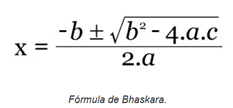
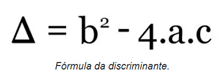

# Lista de Exercícios POO

---

### 📌 **Descrição das Atividades**
[Orientação sobre como desenvolver as atividades](lista_exercicios_00.md)

---

# ☕ Java

# Estrutura Condicional: Exercícios em Java ☕

## Problema 1: Notas 📝

Fazer um programa para ler as duas notas que um aluno obteve no primeiro e segundo semestres de uma disciplina anual. Em seguida, mostrar a nota final que o aluno obteve (com uma casa decimal) no ano juntamente com um texto explicativo. Caso a nota final do aluno seja inferior a 60.00, mostrar a mensagem "REPROVADO".

**Exemplo 1: Aluno Aprovado**

```
Digite a primeira nota: 45.5
Digite a segunda nota: 31.3
NOTA FINAL = 76.8
```

**Exemplo 2: Aluno Reprovado**

```
Digite a primeira nota: 34.0
Digite a segunda nota: 23.5
NOTA FINAL = 57.5
REPROVADO
```

-----

## Problema 2: Fórmula de Bhaskara 📐

Fazer um programa para ler os três coeficientes de uma equação do segundo grau. Usando a fórmula de Bhaskara, o programa deve calcular e mostrar os valores das raízes x1 e x2 da equação com quatro casas decimais. Se a equação não possuir raízes reais, o programa deve exibir uma mensagem apropriada.





**Exemplo 1: Raízes Reais**

```
Coeficiente a: 1
Coeficiente b: 0
Coeficiente c: -9
X1 = 3.0000
X2 = -3.0000
```

**Exemplo 2: Raízes Reais 2**

```
Coeficiente a: 2
Coeficiente b: -4.5
Coeficiente c: 1.7
X1 = 1.7697
X2 = 0.4803
```

**Exemplo 3: Sem Raízes Reais**

```
Coeficiente a: 1
Coeficiente b: 3
Coeficiente c: 4
Esta equacao nao possui raizes reais
```

-----

## Problema 3: Menor de Três 🥉

Fazer um programa para ler três números inteiros. Em seguida, mostrar qual o menor dentre os três números lidos. Em caso de empate, mostrar apenas uma vez.

**Exemplo 1:**

```
Primeiro valor: 7
Segundo valor: 3
Terceiro valor: 8
MENOR = 3
```

**Exemplo 2: Com Empate**

```
Primeiro valor: 5
Segundo valor: 12
Terceiro valor: 5
MENOR = 5
```

-----

## Problema 4: Plano de Telefonia 📱

Uma operadora de telefonia cobra R$ 50.00 por um plano básico que dá direito a 100 minutos de telefone. Cada minuto que exceder a franquia de 100 minutos custa R$ 2.00. Crie um programa que leia a quantidade de minutos consumidos por uma pessoa e exiba o valor final a ser pago.

**Exemplo 1: Dentro da Franquia**

```
Digite a quantidade de minutos: 22
Valor a pagar: R$ 50.00
```

**Exemplo 2: Excedendo a Franquia**

```
Digite a quantidade de minutos: 103
Valor a pagar: R$ 56.00
```

-----

## Problema 5: Troco ou Falta 🛒

Elabore um programa para calcular o troco na venda de um produto. O programa deve ler o preço unitário do produto, a quantidade comprada e o valor em dinheiro recebido pelo cliente. Em seguida, deve exibir o valor do troco a ser devolvido. Se o dinheiro for insuficiente, o programa deve informar quanto dinheiro falta para completar o pagamento.

**Exemplo 1: Troco Correto**

```
Preço unitário do produto: 8.00
Quantidade comprada: 2
Dinheiro recebido: 20.00
TROCO = 4.00
```

**Exemplo 2: Dinheiro Insuficiente**

```
Preço unitário do produto: 30.00
Quantidade comprada: 3
Dinheiro recebido: 70.00
DINHEIRO INSUFICIENTE. FALTAM 20.00 REAIS
```

-----

## Problema 6: Medidor de Glicose 🩸

Faça um programa para ler a quantidade de glicose no sangue de uma pessoa e exibir sua classificação de acordo com a tabela de referência.

| Classificação | Nível de Glicose |
| :--- | :--- |
| Normal | Até 100 mg/dl |
| Elevado | Maior que 100 até 140 mg/dl |
| Diabetes | Maior que 140 mg/dl |

**Exemplos:**

```
Digite a medida da glicose: 90.0
Classificacao: normal
```

```
Digite a medida da glicose: 140.0
Classificacao: elevado
```

```
Digite a medida da glicose: 143.2
Classificacao: diabetes
```

-----

## Problema 7: Lançamento de Dardo 🎯

No arremesso de dardo, um atleta tem três chances para lançar o dardo à maior distância que conseguir. Crie um programa que, dadas as medidas das três tentativas de lançamento, informe qual foi a maior.

**Exemplo:**

```
Digite as tres distancias:
83.21
79.53
89.15
MAIOR DISTANCIA = 89.15
```

-----

## Problema 8: Conversor de Temperatura 🌡️

Construa um programa para converter temperaturas entre as escalas Celsius e Fahrenheit. O programa deve primeiro perguntar ao usuário qual escala ele usará para inserir a temperatura ("C" ou "F"). Em seguida, ele deve ler a temperatura e convertê-la para a outra escala, exibindo o resultado com duas casas decimais.

**Fórmula de Conversão:** C = (5/9) . (F-32)

**Exemplo 1: Fahrenheit para Celsius**

```
Voce vai digitar a temperatura em qual escala (C/F)? F
Digite a temperatura em Fahrenheit: 75.00
Temperatura equivalente em Celsius: 23.89
```

**Exemplo 2: Celsius para Fahrenheit**

```
Voce vai digitar a temperatura em qual escala (C/F)? C
Digite a temperatura em Celsius: 28.15
Temperatura equivalente em Fahrenheit: 82.67
```

-----

## Problema 9: Lanchonete 🍔

Uma lanchonete possui vários produtos, cada um com um código e um preço. Faça um programa que leia o código de um produto e a quantidade comprada e, em seguida, informe o valor total a ser pago com duas casas decimais, conforme a tabela abaixo.

| Código do produto | Preço do produto |
| :--- | :--- |
| 1 | R$ 5.00 |
| 2 | R$ 3.50 |
| 3 | R$ 4.80 |
| 4 | R$ 8.90 |
| 5 | R$ 7.32 |

**Exemplo 1:**

```
Codigo do produto comprado: 1
Quantidade comprada: 3
Valor a pagar: R$ 15.00
```

**Exemplo 2:**

```
Codigo do produto comprado: 4
Quantidade comprada: 2
Valor a pagar: R$ 17.80
```

-----

## Problema 10: Múltiplos 🔢

Crie um programa que leia dois números inteiros e determine se um é múltiplo do outro. Os números podem ser inseridos em qualquer ordem.

**Exemplo 1:**

```
Digite dois numeros inteiros:
6
24
Sao multiplos
```

**Exemplo 2:**

```
Digite dois numeros inteiros:
13
5
Nao sao multiplos
```

-----

## Problema 11: Aumento Salarial 💼

Uma empresa concederá um aumento salarial aos seus funcionários com base em faixas salariais. Fazer um programa para ler o salário de uma pessoa e mostrar o novo salário, o valor do aumento e a porcentagem de aumento, conforme a tabela.

| Salário atual | Aumento |
| :--- | :--- |
| Até R$ 1000.00 | 20% |
| Acima de R$ 1000.00 até R$ 3000.00 | 15% |
| Acima de R$ 3000.00 até R$ 8000.00 | 10% |
| Acima de R$ 8000.00 | 5% |

**Exemplo 1:**

```
Digite o salario da pessoa: 2500.00
Novo salario R$ 2875.00
Aumento R$ 375.00
Porcentagem = 15%
```

**Exemplo 2:**

```
Digite o salario da pessoa: 8000.00
Novo salario R$ 8800.00
Aumento R$ 800.00
Porcentagem = 10%
```

-----

## Problema 12: Duração do Jogo 🕒

Leia a hora inicial e a hora final de um jogo. A seguir, calcule a duração do jogo, sabendo que ele pode começar em um dia e terminar no outro, tendo uma duração mínima de 1 hora e máxima de 24 horas.

**Exemplo 1:**

```
Hora inicial: 16
Hora final: 2
O JOGO DUROU 10 HORA(S)
```

**Exemplo 2:**

```
Hora inicial: 0
Hora final: 0
O JOGO DUROU 24 HORA(S)
```

**Exemplo 3:**

```
Hora inicial: 2
Hora final: 16
O JOGO DUROU 14 HORA(S)
```

-----

## Problema 13: Coordenadas Cartesianas 🗺️

Leia os valores das coordenadas X e Y de um ponto no plano cartesiano. A seguir, determine a qual quadrante o ponto pertence (Q1, Q2, Q3 ou Q4).


* Se o ponto estiver na origem, escreva a mensagem "Origem".
* Se o ponto estiver sobre um dos eixos, escreva "Eixo X" ou "Eixo Y", conforme a situação.

**Exemplo 1:**

```
Valor de X: 4.5
Valor de Y: -2.2
Q4
```

**Exemplo 2:**

```
Valor de X: 3.1
Valor de Y: 2.0
Q1

```

**Exemplo 3:**

```
Valor de X: 0
Valor de Y: 0
Origem
```

**Exemplo 4:**

```
Valor de X: 3.8
Valor de Y: 0
Eixo X
```

---
### Fim da Lista de Exercícios 03

---

### [ricardotecpro.github.io](https://ricardotecpro.github.io/)
