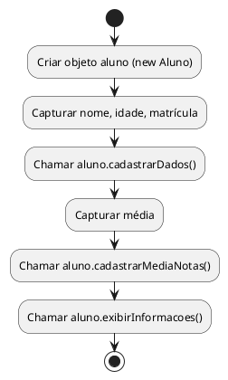

## 📘 Sistema de Cadastro de Alunos em Java (POO)

---

### 🧩 **Objetivo**

Criar uma aplicação Java simples usando **Programação Orientada a Objetos (POO)** que permita:

- Cadastrar dados de um aluno
    
- Cadastrar a média de notas
    
- Exibir todas as informações do aluno
    

---

## 🚀 Etapas do Projeto

---

### 1️⃣ **Criação da Classe `Aluno`**

```java
public class Aluno {
    // Atributos (variáveis de instância)
    private String nome;
    private int idade;
    private int matricula;
    private float media;

    // Método para cadastrar os dados básicos
    public void cadastrarDados(String nome, int idade, int matricula) {
        this.nome = nome;
        this.idade = idade;
        this.matricula = matricula;
    }

    // Método para cadastrar a média de notas
    public void cadastrarMediaNotas(float media) {
        this.media = media;
    }

    // Método para exibir todas as informações
    public void exibirInformacoes() {
        System.out.println("=== DADOS DO ALUNO ===");
        System.out.println("Nome: " + nome);
        System.out.println("Idade: " + idade);
        System.out.println("Matrícula: " + matricula);
        System.out.println("Média de notas: " + media);
    }
}
```

---

### 2️⃣ **Criação da Classe Principal (`Main`)**

```java
import java.util.Scanner;

public class Main {
    public static void main(String[] args) {
        Scanner scanner = new Scanner(System.in);
        Aluno aluno = new Aluno();

        // Entrada de dados
        System.out.print("Digite o nome do aluno: ");
        String nome = scanner.nextLine();

        System.out.print("Digite a idade do aluno: ");
        int idade = scanner.nextInt();

        System.out.print("Digite o número de matrícula: ");
        int matricula = scanner.nextInt();

        aluno.cadastrarDados(nome, idade, matricula);

        System.out.print("Digite a média de notas: ");
        float media = scanner.nextFloat();

        aluno.cadastrarMediaNotas(media);

        // Saída de dados
        aluno.exibirInformacoes();
    }
}
```

---

## 💡 Explicação por Etapas

|Etapa|Conceito Java|
|---|---|
|`private`|Encapsulamento: restringe acesso direto aos atributos|
|`public void cadastrar...()`|Métodos públicos para manipular os dados|
|`Scanner`|Entrada de dados via console|
|`System.out.println`|Impressão de informações|

---

## 📄 Arquitetura do Projeto

```
/src
 ├── Main.java
 └── Aluno.java
```

---

## 📊 Fluxograma (Lógica do Programa)

Você pode usar o mesmo fluxograma que criamos em PlantUML anteriormente para este projeto em Java, pois a **lógica de execução é equivalente** à versão C++:



---

## ✅ O que os alunos aprendem com esse exercício?

- **Encapsulamento**
    
- **Criação e uso de classes e objetos**
    
- **Entrada e saída de dados**
    
- **Separação de responsabilidades**
    
- **Boa prática de código limpo**
    

---
