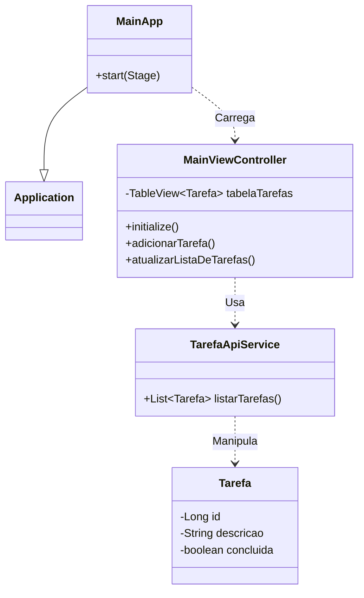

### **Parte 3: O Frontend Desktop com JavaFX**

A aplicação nativa, com layout e funcionalidades consistentes com a versão web.

---
(`listadetarefas-desktop`)

**Objetivo:** Criar uma aplicação desktop nativa e funcional que consome a API backend.

### 🛠️ Ferramentas Necessárias

  * **Java Development Kit (JDK):** Versão 21.
  * **IDE:** IntelliJ IDEA ou VS Code com o "Extension Pack for Java".

### \#\#\# 📂 Passo 1: Criação e Configuração do Projeto

1.  **Crie um projeto Maven** na sua IDE para `listadetarefas-desktop` (siga as instruções detalhadas do guia anterior para IntelliJ ou VS Code).
2.  **Substitua o `pom.xml`** pelo código completo fornecido no guia anterior, que inclui JavaFX, Jackson e o `maven-shade-plugin`.
3.  **Crie o arquivo `module-info.java`** em `src/main/java` com a versão final e corrigida, contendo todos os `requires`, `opens` e `exports` necessários.

### \#\#\# 🏗️ Passo 2: Estrutura de Código e UI

Siga os passos e use os códigos completos e detalhados do guia anterior para criar a estrutura final.

#### Diagrama de Classes do Cliente Desktop



---


#### **Estrutura de Pastas (Desktop)**

```
listadetarefas-desktop/
├── pom.xml
└── src/
    └── main/
        ├── java/
        │   ├── br/com/curso/listadetarefas/desktop/
        │   │   ├── Launcher.java
        │   │   ├── MainApp.java
        │   │   ├── MainViewController.java
        │   │   ├── Tarefa.java
        │   │   └── TarefaApiService.java
        │   └── module-info.java
        └── resources/
            └── br/com/curso/listadetarefas/desktop/
                └── MainView.fxml
```

#### **Descrição dos Arquivos (Desktop)**

  * `pom.xml`: Arquivo de configuração do Maven.
  * `module-info.java`: Arquivo do Sistema de Módulos do Java.
  * `MainView.fxml`: Arquivo XML que define a estrutura visual da aplicação.
  * `Launcher.java`: Ponto de entrada para o JAR executável.
  * `MainApp.java`: Classe principal que inicia a aplicação JavaFX.
  * `Tarefa.java`: Modelo de dados (POJO) para uma tarefa.
  * `TarefaApiService.java`: Serviço que realiza a comunicação com a API.
  * `MainViewController.java`: Controlador da interface, com todas as funcionalidades e correções.

#### **Código Completo (Desktop)**

**1. `pom.xml`**

```xml
<?xml version="1.0" encoding="UTF-8"?>
<project xmlns="http://maven.apache.org/POM/4.0.0"
         xmlns:xsi="http://www.w3.org/2001/XMLSchema-instance"
         xsi:schemaLocation="http://maven.apache.org/POM/4.0.0 http://maven.apache.org/xsd/maven-4.0.0.xsd">
    <modelVersion>4.0.0</modelVersion>
    <groupId>br.com.curso</groupId>
    <artifactId>listadetarefas-desktop</artifactId>
    <version>1.0-SNAPSHOT</version>
    <properties>
        <project.build.sourceEncoding>UTF-8</project.build.sourceEncoding>
        <maven.compiler.source>17</maven.compiler.source>
        <maven.compiler.target>17</maven.compiler.target>
        <javafx.version>17.0.6</javafx.version>
    </properties>
    <dependencies>
        <dependency>
            <groupId>org.openjfx</groupId>
            <artifactId>javafx-controls</artifactId>
            <version>${javafx.version}</version>
        </dependency>
        <dependency>
            <groupId>org.openjfx</groupId>
            <artifactId>javafx-fxml</artifactId>
            <version>${javafx.version}</version>
        </dependency>
        <dependency>
            <groupId>com.fasterxml.jackson.core</groupId>
            <artifactId>jackson-databind</artifactId>
            <version>2.17.0</version>
        </dependency>
    </dependencies>
    <build>
        <plugins>
            <plugin>
                <groupId>org.apache.maven.plugins</groupId>
                <artifactId>maven-compiler-plugin</artifactId>
                <version>3.11.0</version>
            </plugin>
            <plugin>
                <groupId>org.openjfx</groupId>
                <artifactId>javafx-maven-plugin</artifactId>
                <version>0.0.8</version>
                <configuration>
                    <mainClass>br.com.curso.listadetarefas.desktop.Launcher</mainClass>
                </configuration>
            </plugin>
            <plugin>
                <groupId>org.apache.maven.plugins</groupId>
                <artifactId>maven-shade-plugin</artifactId>
                <version>3.5.1</version>
                <executions>
                    <execution>
                        <phase>package</phase>
                        <goals>
                            <goal>shade</goal>
                        </goals>
                        <configuration>
                            <transformers>
                                <transformer implementation="org.apache.maven.plugins.shade.resource.ManifestResourceTransformer">
                                    <mainClass>br.com.curso.listadetarefas.desktop.Launcher</mainClass>
                                </transformer>
                            </transformers>
                        </configuration>
                    </execution>
                </executions>
            </plugin>
        </plugins>
    </build>
</project>
```

**2. `module-info.java`**

```java
module br.com.curso.listadetarefas.desktop {
    requires javafx.controls;
    requires javafx.fxml;
    requires com.fasterxml.jackson.databind;
    requires java.net.http;

    opens br.com.curso.listadetarefas.desktop to javafx.fxml, com.fasterxml.jackson.databind;
    exports br.com.curso.listadetarefas.desktop;
}
```

**3. `resources/br/com/curso/listadetarefas/desktop/MainView.fxml`**

```xml
<?xml version="1.0" encoding="UTF-8"?>

<?import javafx.geometry.Insets?>
<?import javafx.scene.control.Button?>
<?import javafx.scene.control.Label?>
<?import javafx.scene.control.TableColumn?>
<?import javafx.scene.control.TableView?>
<?import javafx.scene.control.TextField?>
<?import javafx.scene.layout.BorderPane?>
<?import javafx.scene.layout.HBox?>
<?import javafx.scene.text.Font?>

<BorderPane maxHeight="-Infinity" maxWidth="-Infinity" minHeight="-Infinity" minWidth="-Infinity" prefHeight="600.0" prefWidth="800.0" xmlns="http://javafx.com/javafx/17" xmlns:fx="http://javafx.com/fxml/1" fx:controller="br.com.curso.listadetarefas.desktop.MainViewController">
   <top>
      <HBox alignment="CENTER_LEFT" prefHeight="70.0" spacing="10.0" BorderPane.alignment="CENTER">
         <padding>
            <Insets bottom="10.0" left="10.0" right="10.0" top="10.0" />
         </padding>
         <children>
            <Label text="Nova Tarefa:">
               <font>
                  <Font name="System Bold" size="14.0" />
               </font>
            </Label>
            <TextField fx:id="novaTarefaTextField" HBox.hgrow="ALWAYS" onAction="#adicionarTarefa" promptText="O que precisa ser feito?" />
            <Button onAction="#adicionarTarefa" style="-fx-base: #4CAF50;" text="Adicionar" textFill="WHITE">
               <font>
                  <Font name="System Bold" size="12.0" />
               </font>
            </Button>
            <Button fx:id="atualizarButton" onAction="#carregarTarefas" style="-fx-base: #2196F3;" text="🔄" textFill="WHITE" />
            <Button fx:id="excluirSelecionadosButton" onAction="#deletarTarefasSelecionadas" style="-fx-base: #F44336;" text="Excluir Selecionadas" textFill="WHITE" />
         </children>
      </HBox>
   </top>
   <center>
      <TableView fx:id="tabelaTarefas" editable="true" prefHeight="200.0" prefWidth="200.0" BorderPane.alignment="CENTER">
         <columns>
            <TableColumn fx:id="colunaSelecao" prefWidth="50.0" text="Sel." />
            <TableColumn fx:id="colunaConcluida" prefWidth="75.0" text="Status" />
            <TableColumn fx:id="colunaTitulo" prefWidth="200.0" text="Título" />
            <TableColumn fx:id="colunaDescricao" prefWidth="250.0" text="Descrição" />
            <TableColumn fx:id="colunaAcoes" prefWidth="150.0" text="Ações" />
         </columns>
         <columnResizePolicy>
            <TableView fx:constant="CONSTRAINED_RESIZE_POLICY" />
         </columnResizePolicy>
      </TableView>
   </center>
</BorderPane>
```

**4. `Launcher.java`**

```java
package br.com.curso.listadetarefas.desktop;

public class Launcher {
    public static void main(String[] args) {
        MainApp.main(args);
    }
}
```

**5. `MainApp.java`**

```java
package br.com.curso.listadetarefas.desktop;

import javafx.application.Application;
import javafx.fxml.FXMLLoader;
import javafx.scene.Scene;
import javafx.stage.Stage;

public class MainApp extends Application {
    @Override
    public void start(Stage stage) throws Exception {
        FXMLLoader fxmlLoader = new FXMLLoader(MainApp.class.getResource("MainView.fxml"));
        Scene scene = new Scene(fxmlLoader.load(), 800, 600);
        stage.setTitle("Minha Lista de Tarefas (Desktop)");
        stage.setScene(scene);
        stage.show();
    }
    public static void main(String[] args) {
        launch(args);
    }
}
```

**6. `Tarefa.java`**

```java
package br.com.curso.listadetarefas.desktop;

import com.fasterxml.jackson.annotation.JsonIgnore;
import com.fasterxml.jackson.annotation.JsonIgnoreProperties;
import javafx.beans.property.BooleanProperty;
import javafx.beans.property.SimpleBooleanProperty;

@JsonIgnoreProperties(ignoreUnknown = true)
public class Tarefa {
    private Long id;
    private String titulo;
    private String descricao;
    private boolean concluida;

    @JsonIgnore
    private final BooleanProperty selecionada = new SimpleBooleanProperty(false);

    public Long getId() { return id; }
    public void setId(Long id) { this.id = id; }

    public String getTitulo() { return titulo; }
    public void setTitulo(String titulo) { this.titulo = titulo; }

    public String getDescricao() { return descricao; }
    public void setDescricao(String descricao) { this.descricao = descricao; }
    public boolean isConcluida() { return concluida; }
    public void setConcluida(boolean concluida) { this.concluida = concluida; }

    public boolean isSelecionada() { return selecionada.get(); }
    public BooleanProperty selecionadaProperty() { return selecionada; }
    public void setSelecionada(boolean selecionada) { this.selecionada.set(selecionada); }
}

```

**7. `TarefaApiService.java`**

```java
package br.com.curso.listadetarefas.desktop;

import com.fasterxml.jackson.core.type.TypeReference;
import com.fasterxml.jackson.databind.ObjectMapper;
import java.io.IOException;
import java.net.URI;
import java.net.http.HttpClient;
import java.net.http.HttpRequest;
import java.net.http.HttpResponse;
import java.util.Collections;
import java.util.List;

public class TarefaApiService {
    private final HttpClient client = HttpClient.newHttpClient();
    private final ObjectMapper objectMapper = new ObjectMapper();
    private final String API_URL = "http://localhost:8080/tarefas";

    public List<Tarefa> listarTarefas() {
        HttpRequest request = HttpRequest.newBuilder()
                .uri(URI.create(API_URL))
                .header("Accept", "application/json")
                .GET()
                .build();
        try {
            HttpResponse<String> response = client.send(request, HttpResponse.BodyHandlers.ofString());
            if (response.statusCode() == 200) {
                return objectMapper.readValue(response.body(), new TypeReference<>() {});
            }
        } catch (IOException | InterruptedException e) {
            e.printStackTrace();
        }
        return Collections.emptyList();
    }

    public void adicionarTarefa(Tarefa novaTarefa) {
        try {
            String jsonBody = objectMapper.writeValueAsString(novaTarefa);
            HttpRequest request = HttpRequest.newBuilder()
                    .uri(URI.create(API_URL))
                    .header("Content-Type", "application/json")
                    .header("Accept", "application/json")
                    .POST(HttpRequest.BodyPublishers.ofString(jsonBody))
                    .build();
            client.send(request, HttpResponse.BodyHandlers.ofString());
        } catch (IOException | InterruptedException e) {
            e.printStackTrace();
        }
    }

    public void atualizarTarefa(Tarefa tarefa) {
        try {
            String jsonBody = objectMapper.writeValueAsString(tarefa);
            HttpRequest request = HttpRequest.newBuilder()
                    .uri(URI.create(API_URL + "/" + tarefa.getId()))
                    .header("Content-Type", "application/json")
                    .header("Accept", "application/json")
                    .PUT(HttpRequest.BodyPublishers.ofString(jsonBody))
                    .build();
            client.send(request, HttpResponse.BodyHandlers.ofString());
        } catch (IOException | InterruptedException e) {
            e.printStackTrace();
        }
    }

    public void deletarTarefa(Long id) {
        try {
            HttpRequest request = HttpRequest.newBuilder()
                    .uri(URI.create(API_URL + "/" + id))
                    .header("Accept", "application/json")
                    .DELETE()
                    .build();
            client.send(request, HttpResponse.BodyHandlers.ofString());
        } catch (IOException | InterruptedException e) {
            e.printStackTrace();
        }
    }
}
```

**8. `MainViewController.java`**

```java
package br.com.curso.listadetarefas.desktop;

import javafx.application.Platform;
import javafx.collections.FXCollections;
import javafx.concurrent.Task;
import javafx.fxml.FXML;
import javafx.fxml.Initializable;
import javafx.geometry.Insets;
import javafx.geometry.Pos;
import javafx.scene.control.*;
import javafx.scene.control.cell.CheckBoxTableCell;
import javafx.scene.control.cell.PropertyValueFactory;
import javafx.scene.layout.GridPane;
import javafx.scene.layout.HBox;
import java.net.URL;
import java.util.List;
import java.util.Optional;
import java.util.ResourceBundle;
import java.util.stream.Collectors;

public class MainViewController implements Initializable {

    @FXML private TableView<Tarefa> tabelaTarefas;
    @FXML private TableColumn<Tarefa, Boolean> colunaSelecao;
    @FXML private TableColumn<Tarefa, Boolean> colunaConcluida;
    @FXML private TableColumn<Tarefa, String> colunaTitulo;
    @FXML private TableColumn<Tarefa, String> colunaDescricao;
    @FXML private TableColumn<Tarefa, Void> colunaAcoes;
    @FXML private TextField novaTarefaTextField;

    private final TarefaApiService tarefaService = new TarefaApiService();

    @Override
    public void initialize(URL url, ResourceBundle resourceBundle) {
        configurarTabela();
        carregarTarefas();
    }

    private void configurarTabela() {
        // Coluna de Seleção
        colunaSelecao.setCellValueFactory(cellData -> cellData.getValue().selecionadaProperty());
        colunaSelecao.setCellFactory(CheckBoxTableCell.forTableColumn(colunaSelecao));
        colunaSelecao.setEditable(true);

        // Coluna de Status (com correção de sincronização)
        colunaConcluida.setCellValueFactory(new PropertyValueFactory<>("concluida"));
        colunaConcluida.setCellFactory(CheckBoxTableCell.forTableColumn(colunaConcluida));
        colunaConcluida.setOnEditCommit(event -> {
            Tarefa tarefa = event.getRowValue();
            tarefa.setConcluida(event.getNewValue());
            atualizarTarefa(tarefa);
        });

        // Coluna de Título
        colunaTitulo.setCellValueFactory(new PropertyValueFactory<>("titulo"));

        // Coluna de Descrição
        colunaDescricao.setCellValueFactory(new PropertyValueFactory<>("descricao"));

        // Coluna de Ações
        colunaAcoes.setCellFactory(param -> new TableCell<>() {
            private final Button btnEditar = new Button("Editar");
            private final Button btnExcluir = new Button("Excluir");
            private final HBox pane = new HBox(5, btnEditar, btnExcluir);
            {
                pane.setAlignment(Pos.CENTER);
                btnEditar.setStyle("-fx-base: #FFC107;");
                btnExcluir.setStyle("-fx-base: #F44336; -fx-text-fill: white;");
                btnEditar.setOnAction(event -> abrirDialogoEdicao(getTableView().getItems().get(getIndex())));
                btnExcluir.setOnAction(event -> confirmarExclusao(getTableView().getItems().get(getIndex())));
            }
            @Override
            protected void updateItem(Void item, boolean empty) {
                super.updateItem(item, empty);
                setGraphic(empty ? null : pane);
            }
        });

        tabelaTarefas.setEditable(true);
    }

    @FXML
    private void carregarTarefas() {
        Task<List<Tarefa>> task = new Task<>() {
            @Override
            protected List<Tarefa> call() {
                return tarefaService.listarTarefas();
            }
        };
        task.setOnSucceeded(e -> tabelaTarefas.setItems(FXCollections.observableArrayList(task.getValue())));
        task.setOnFailed(e -> exibirAlerta("Erro", "Não foi possível carregar as tarefas."));
        new Thread(task).start();
    }

    @FXML
    private void adicionarTarefa() {
        String titulo = novaTarefaTextField.getText().trim();
        if (titulo.isEmpty()) {
            exibirAlerta("Campo Vazio", "O título não pode ser vazio.");
            return;
        }
        Tarefa novaTarefa = new Tarefa();
        novaTarefa.setTitulo(titulo);
        novaTarefa.setDescricao(""); // A descrição pode ser adicionada/editada depois
        novaTarefa.setConcluida(false);

        Task<Void> task = new Task<>() {
            @Override
            protected Void call() {
                tarefaService.adicionarTarefa(novaTarefa);
                return null;
            }
        };
        task.setOnSucceeded(e -> {
            novaTarefaTextField.clear();
            carregarTarefas();
        });
        task.setOnFailed(e -> exibirAlerta("Erro", "Não foi possível criar a tarefa."));
        new Thread(task).start();
    }

    private void atualizarTarefa(Tarefa tarefa) {
        Task<Void> task = new Task<>() {
            @Override
            protected Void call() {
                tarefaService.atualizarTarefa(tarefa);
                return null;
            }
        };
        task.setOnFailed(e -> {
            exibirAlerta("Erro", "Não foi possível sincronizar a tarefa. Recarregando...");
            carregarTarefas();
        });
        new Thread(task).start();
    }

    private void abrirDialogoEdicao(Tarefa tarefa) {
        Dialog<Tarefa> dialog = new Dialog<>();
        dialog.setTitle("Editar Tarefa");

        // Configura os botões
        ButtonType salvarButtonType = new ButtonType("Salvar", ButtonBar.ButtonData.OK_DONE);
        dialog.getDialogPane().getButtonTypes().addAll(salvarButtonType, ButtonType.CANCEL);

        // Cria os campos de texto
        GridPane grid = new GridPane();
        grid.setHgap(10);
        grid.setVgap(10);
        grid.setPadding(new Insets(20, 150, 10, 10));

        TextField tituloField = new TextField(tarefa.getTitulo());
        tituloField.setPromptText("Título");
        TextArea descricaoArea = new TextArea(tarefa.getDescricao());
        descricaoArea.setPromptText("Descrição");

        grid.add(new Label("Título:"), 0, 0);
        grid.add(tituloField, 1, 0);
        grid.add(new Label("Descrição:"), 0, 1);
        grid.add(descricaoArea, 1, 1);

        dialog.getDialogPane().setContent(grid);

        // Converte o resultado para um objeto Tarefa
        dialog.setResultConverter(dialogButton -> {
            if (dialogButton == salvarButtonType) {
                tarefa.setTitulo(tituloField.getText());
                tarefa.setDescricao(descricaoArea.getText());
                return tarefa;
            }
            return null;
        });

        Optional<Tarefa> result = dialog.showAndWait();
        result.ifPresent(this::atualizarTarefa);
    }

    private void confirmarExclusao(Tarefa tarefa) {
        Alert alert = new Alert(Alert.AlertType.CONFIRMATION);
        alert.setTitle("Confirmar Exclusão");
        alert.setHeaderText("Excluir tarefa: " + tarefa.getTitulo());
        alert.setContentText("Você tem certeza?");
        alert.showAndWait().filter(r -> r == ButtonType.OK).ifPresent(r -> deletarTarefa(tarefa));
    }

    private void deletarTarefa(Tarefa tarefa) {
        Task<Void> task = new Task<>() {
            @Override
            protected Void call() {
                tarefaService.deletarTarefa(tarefa.getId());
                return null;
            }
        };
        task.setOnSucceeded(e -> carregarTarefas());
        task.setOnFailed(e -> exibirAlerta("Erro", "Não foi possível excluir a tarefa."));
        new Thread(task).start();
    }

    @FXML
    private void deletarTarefasSelecionadas() {
        List<Tarefa> tarefasParaExcluir = tabelaTarefas.getItems().stream()
                .filter(Tarefa::isSelecionada)
                .collect(Collectors.toList());

        if (tarefasParaExcluir.isEmpty()) {
            exibirAlerta("Nenhuma Seleção", "Nenhuma tarefa foi selecionada.");
            return;
        }

        Alert alert = new Alert(Alert.AlertType.CONFIRMATION);
        alert.setTitle("Confirmar Exclusão em Massa");
        alert.setHeaderText("Excluir " + tarefasParaExcluir.size() + " tarefa(s)");
        alert.setContentText("Você tem certeza?");

        alert.showAndWait().filter(r -> r == ButtonType.OK).ifPresent(r -> {
            Task<Void> task = new Task<>() {
                @Override
                protected Void call() {
                    for (Tarefa tarefa : tarefasParaExcluir) {
                        tarefaService.deletarTarefa(tarefa.getId());
                    }
                    return null;
                }
            };
            task.setOnSucceeded(e -> carregarTarefas());
            task.setOnFailed(e -> exibirAlerta("Erro", "Ocorreu um erro ao excluir as tarefas."));
            new Thread(task).start();
        });
    }

    private void exibirAlerta(String titulo, String mensagem) {
        Platform.runLater(() -> {
            Alert alert = new Alert(Alert.AlertType.WARNING);
            alert.setTitle(titulo);
            alert.setHeaderText(null);
            alert.setContentText(mensagem);
            alert.showAndWait();
        });
    }
}

```
---


#### Estrutura de Pastas e Arquivos Final do Desktop

```
listadetarefas-desktop/
├── src/
│   └── main/
│       ├── java/
│       │   ├── br/com/curso/listadetarefas/desktop/
│       │   │   ├── Launcher.java
│       │   │   ├── MainApp.java
│       │   │   ├── MainViewController.java
│       │   │   ├── Tarefa.java
│       │   │   └── TarefaApiService.java
│       │   └── module-info.java
│       └── resources/
│           └── br/com/curso/listadetarefas/desktop/
│               └── MainView.fxml
└── pom.xml
```

### \#\#\# ✅ Passo 3: Construção e Teste

1.  **Pré-requisito:** A API backend deve estar rodando.
2.  **Construa:** No terminal, na raiz do projeto, rode `mvn clean package`.
3.  **Execute:** Rode o JAR gerado: `java -jar target/listadetarefas-desktop-1.0-SNAPSHOT.jar`.
4.  **Teste:** Verifique todas as funcionalidades: adicionar, deletar, atualizar a lista, e editar a descrição com duplo clique.

---

**Construa:** No terminal, na raiz do projeto

```bash
mvn clean package
```
**Execute:** Rode o JAR gerado


```bash
java -jar target/listadetarefas-desktop-1.0-SNAPSHOT.jar
```

ou

```bash
.\mvnw javafx:run
```
---

Tela da aplicação desktop:


---

### 🚀 [ricardotecpro.github.io](https://ricardotecpro.github.io/)
